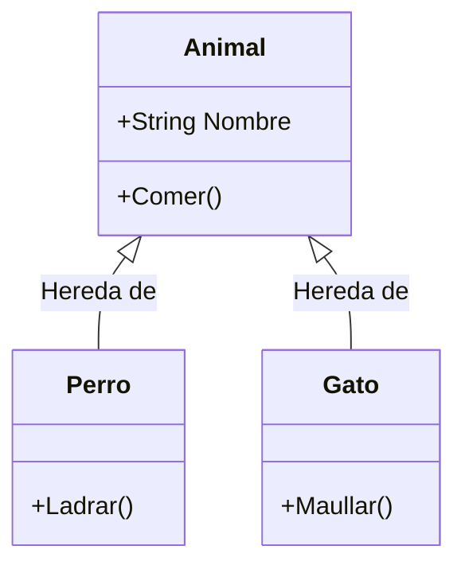
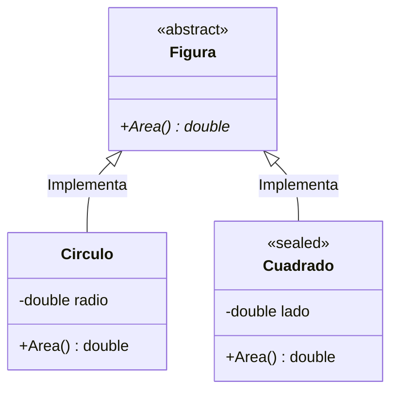
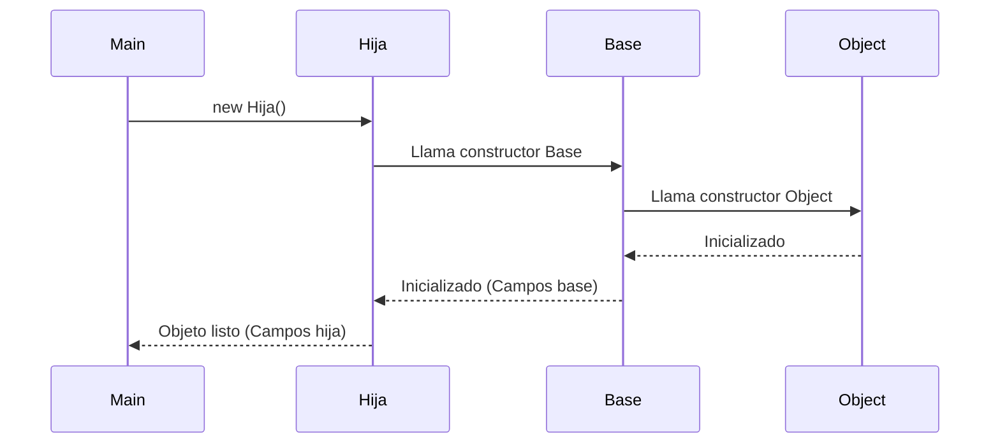
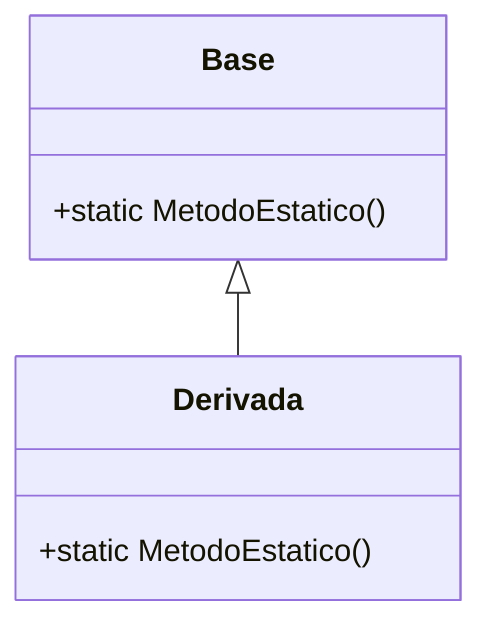

- [1. Fundamentos de la Herencia](#1-fundamentos-de-la-herencia)
  - [1.1 Herencia en C#](#11-herencia-en-c)
    - [¿Qué es la herencia?](#qué-es-la-herencia)
    - [Ventajas y Desventajas](#ventajas-y-desventajas)
    - [Ejemplo didáctico](#ejemplo-didáctico)
    - [Ejemplo avanzado](#ejemplo-avanzado)
  - [1.2 Modificadores de acceso y de herencia](#12-modificadores-de-acceso-y-de-herencia)
    - [Acceso](#acceso)
      - [Tabla de Visibilidad (Guía rápida)](#tabla-de-visibilidad-guía-rápida)
    - [De herencia](#de-herencia)
      - [Representación Visual](#representación-visual)
      - [Ejemplo](#ejemplo)
  - [1.3 Uso de `base` en Herencia: constructores, métodos, propiedades e inicializadores](#13-uso-de-base-en-herencia-constructores-métodos-propiedades-e-inicializadores)
    - [1.3.1. Invocando el constructor de la clase base con `base`](#131-invocando-el-constructor-de-la-clase-base-con-base)
    - [1.3.2. Extendiendo y reutilizando métodos y propiedades heredados con `base`](#132-extendiendo-y-reutilizando-métodos-y-propiedades-heredados-con-base)
    - [1.3.3. Sobrescribir propiedades virtuales y acceder a la base](#133-sobrescribir-propiedades-virtuales-y-acceder-a-la-base)
    - [1.3.4. Orden de inicialización de campos y constructores](#134-orden-de-inicialización-de-campos-y-constructores)
    - [1.3.5. Modificando inicializadores en la derivada](#135-modificando-inicializadores-en-la-derivada)
    - [1.3.6. Orden de ejecución de inicializadores y constructores en herencia](#136-orden-de-ejecución-de-inicializadores-y-constructores-en-herencia)
    - [Resumen didáctico](#resumen-didáctico)
  - [1.4. Miembros Estáticos y Herencia (¡Importante!)](#14-miembros-estáticos-y-herencia-importante)
    - [¿Se heredan los métodos estáticos?](#se-heredan-los-métodos-estáticos)
    - [¿Son polimórficos? (¿Funcionan con `override`?)](#son-polimórficos-funcionan-con-override)
    - [Ejemplo de "Ocultación" Estática](#ejemplo-de-ocultación-estática)


# 1. Fundamentos de la Herencia

En este módulo sentaremos las bases de la Programación Orientada a Objetos avanzada, entendiendo cómo extender clases, controlar el acceso a sus miembros e inicializarlas correctamente.

---

## 1.1 Herencia en C#

### ¿Qué es la herencia?

La herencia permite crear nuevas clases a partir de una clase existente, obteniendo sus campos, propiedades y métodos, y pudiendo ampliar o modificar su comportamiento.

Las clases se agrupan en una **jerarquía**:
- **Clase base** (superclase): de la que se hereda.
- **Clase derivada** (subclase): que hereda y puede ampliar o modificar.

El objetivo es reutilizar código y organizar el programa de manera lógica y extensible.



En los lenguajes orientados a objetos, la herencia es un pilar fundamental que permite la creación de nuevas clases basadas en clases existentes. Esto facilita la reutilización de código, la organización lógica y la extensibilidad del software. Además tenemos varios tipos de herencia según los lenguajes de programación:

- **Herencia simple:** Una clase derivada hereda de una sola clase base. (C#, Java)
- **Herencia múltiple:** Una clase derivada hereda de múltiples clases base. (C++). C# no soporta herencia múltiple de clases, pero sí permite implementar múltiples interfaces.

Cada tipo de herencia tiene sus pros y contras, y la elección depende del diseño y los requisitos del software.

### Ventajas y Desventajas

| Tipo | Ventajas | Desventajas |
| :--- | :--- | :--- |
| **Herencia simple** | Simplicidad, menor complejidad, fácil de entender y mantener. | Menos flexible, puede requerir más clases para representar relaciones complejas. |
| **Herencia múltiple** | Mayor flexibilidad, permite combinar comportamientos de múltiples clases. | Mayor complejidad, problemas como la "ambigüedad del diamante", difícil de mantener. |

El **uso adecuado de la herencia** es crucial para un buen diseño orientado a objetos. Se recomienda usarla cuando existe una relación "es un" clara entre la clase base y la derivada, y evitarla cuando la composición (relación "tiene un") es más apropiada.

> **Consejo Pedagógico:**
> Antes de heredar, hazte la pregunta del "ES UN".
> * ¿Un Perro **ES UN** Animal? -> SÍ (Herencia correcta).
> * ¿Un Coche **ES UN** Motor? -> NO (Un coche *TIENE UN* motor -> Usa Composición).

**El problema de la ambigüedad del diamante:** Es un problema que surge en la herencia múltiple cuando una clase derivada hereda de dos clases base que a su vez heredan de una misma clase base. Esto puede causar ambigüedad sobre qué versión de un método o propiedad debe utilizar la clase derivada. ¿Cómo se resuelve? Cada lenguaje tiene sus propias reglas y mecanismos para manejar este problema, como el uso de interfaces en C# o la especificación explícitamente de la clase base en C++, en Python se resuelve automáticamente mediante el algoritmo C3 Linearization (MRO, Method Resolution Order).


### Ejemplo didáctico

```csharp
public class Animal
{
    public string Nombre { get; set; }
    public void Comer() => Console.WriteLine($"{Nombre} está comiendo.");
}

public class Perro : Animal
{
    public void Ladrar() => Console.WriteLine("Guau guau!");
}
```

El `Perro` puede acceder y usar los métodos de la clase base `Animal`.

### Ejemplo avanzado

```csharp
public class Animal
{
    public string Nombre { get; set; }
    public virtual void Mover() => Console.WriteLine("Animal se mueve.");
}

public class Ave : Animal
{
    public override void Mover() => Console.WriteLine($"{Nombre} vuela.");
}

public class Pez : Animal
{
    public override void Mover() => Console.WriteLine($"{Nombre} nada.");
}
```

En este ejemplo, el método `Mover` tiene un comportamiento diferente dependiendo de la subclase.

---

## 1.2 Modificadores de acceso y de herencia

### Acceso

Los modificadores de acceso definen la visibilidad de los miembros de una clase. Es fundamental entenderlos para aplicar correctamente el principio de **encapsulamiento**.

- **public:** Accesible desde cualquier parte.
- **private:** Solo desde la clase actual.
- **protected:** Desde la clase actual y sus derivadas.
- **internal:** Solo dentro del mismo ensamblado (proyecto).
- **protected internal / private protected:** Combinaciones avanzadas.

#### Tabla de Visibilidad (Guía rápida)

| Modificador | Clase Base | Clase Derivada (mismo assembly) | Clase Derivada (otro assembly) | Clase No Derivada (mismo assembly) | Mundo Exterior |
| :--- | :---: | :---: | :---: | :---: | :---: |
| **public** | ✅ | ✅ | ✅ | ✅ | ✅ |
| **protected internal** | ✅ | ✅ | ✅ | ✅ | ❌ |
| **internal** | ✅ | ✅ | ❌ | ✅ | ❌ |
| **protected** | ✅ | ✅ | ✅ | ❌ | ❌ |
| **private protected** | ✅ | ✅ | ❌ | ❌ | ❌ |
| **private** | ✅ | ❌ | ❌ | ❌ | ❌ |

### De herencia

Además de la visibilidad, existen modificadores que controlan *cómo* se hereda un miembro.

- **abstract:** Indica que una clase/método no tiene implementación en la clase base y debe ser implementado en las derivadas.
- **virtual:** Permite que el método pueda ser sobrescrito en las derivadas.
- **override:** Redefine un método virtual/abstracto.
- **sealed:** Impide que una clase o método sea heredado o sobrescrito.
- **new:** Oculta el miembro de la base, creando uno nuevo con el mismo nombre (no sobrescribe realmente).

#### Representación Visual



#### Ejemplo

```csharp
// Clase base abstracta, no se puede instanciar. Sirve como base.
public abstract class Figura
{
    public abstract double Area();
}

// Clase derivada que implementa el método abstracto, se puede instanciar y se puede heredar.
public class Circulo : Figura
{
    private double radio;
    public Circulo(double r) { radio = r; }
    public override double Area() => Math.PI * radio * radio;
}

// Clase sellada que no se puede heredar. Se usa como ejemplo de clase final de la jerarquía.
public sealed class Cuadrado : Figura
{
    private double lado;
    public Cuadrado(double l) { lado = l; }
    public override double Area() => lado * lado;
}
```

---

## 1.3 Uso de `base` en Herencia: constructores, métodos, propiedades e inicializadores

En la programación orientada a objetos en C#, el mecanismo de herencia permite que una clase derive de otra y herede su estado (campos y propiedades) y comportamiento (métodos). La clave para gestionar correctamente la herencia y la ampliación o reutilización de funcionalidad es saber cómo funciona la palabra clave `base` y la inicialización de objetos.

**La palabra clave `base`**:
- Permite acceder a miembros (métodos, propiedades y constructores) de la clase base desde la clase derivada.
- Es útil para invocar explícitamente el constructor de la base cuando creamos una instancia de una clase derivada.
- Es empleada en métodos sobrescritos para llamar al método de la base, si se quiere ampliar y no reemplazar el comportamiento original. 
- Permite acceder a propiedades heredadas, incluso si son sobrescritas con `override` en la clase derivada.

**Inicialización en herencia**:
El orden es estricto y va de lo más general a lo más específico.



Cuando creamos una instancia de una clase derivada, el proceso de inicialización se realiza de la siguiente forma:
1. Se inicializan los campos y propiedades de la clase base.
2. Se ejecuta el constructor de la clase base.
3. Se inicializan los campos y propiedades de la clase derivada.
4. Se ejecuta el constructor de la clase derivada.

Este orden garantiza que el objeto empieza inicializando la parte más general y acaba con la parte más específica.

### 1.3.1. Invocando el constructor de la clase base con `base`

```csharp
public class Vehiculo
{
    public string Marca;
    public Vehiculo(string marca)
    {
        Marca = marca;
        Console.WriteLine("Constructor Vehiculo");
    }
}

public class Coche : Vehiculo
{
    public string Modelo;
    public Coche(string marca, string modelo)
        : base(marca) // Llama explícitamente al constructor de la base
    {
        Modelo = modelo;
        Console.WriteLine("Constructor Coche");
    }
}

// Uso:
Coche coche = new Coche("Volkswagen", "Golf");
// Salida:
// Constructor Vehiculo
// Constructor Coche
```

Además gracias al constrctor primario de C# podemos simplificarlo aún más:

```csharp
// El parámetro 'marca' se pasa directamente al constructor de Vehiculo
public class Coche(string marca) : Vehiculo(marca)
{
    public string Modelo { get; set; }
}

// Uso:
Coche coche = new Coche("Toyota");
Console.WriteLine(coche.Marca); // Toyota

```

### 1.3.2. Extendiendo y reutilizando métodos y propiedades heredados con `base`

```csharp
public class Vehiculo
{
    public virtual void Arrancar()
    {
        Console.WriteLine("Vehículo arrancando genéricamente.");
    }
}

public class Moto : Vehiculo
{
    public override void Arrancar()
    {
        base.Arrancar(); // Llama al método de la base
        Console.WriteLine("La moto acelera tras arrancar.");
    }
}

// Uso:
Moto moto = new Moto();
moto.Arrancar();
// Salida:
// Vehículo arrancando genéricamente.
// La moto acelera tras arrancar.
```

### 1.3.3. Sobrescribir propiedades virtuales y acceder a la base

```csharp
public class Electrodomestico
{
    public string Marca { get; set; } = "Sin marca";
    public virtual string Descripcion => $"Electrodoméstico de marca {Marca}";
}

public class Lavadora : Electrodomestico
{
    public string TipoCarga { get; set; } = "Frontal";
    public override string Descripcion =>
        base.Descripcion + $", tipo de carga: {TipoCarga}";
}

// Uso:
Lavadora lavadora = new Lavadora { Marca = "Bosch", TipoCarga = "Superior" };
Console.WriteLine(lavadora.Descripcion);
// Salida:
// Electrodoméstico de marca Bosch, tipo de carga: Superior
```

### 1.3.4. Orden de inicialización de campos y constructores

```csharp
public class Animal
{
    public string Especie = "Desconocida"; // Inicializador de campo
    public Animal()
    {
        Console.WriteLine($"Animal: Constructor ejecutado. Especie: {Especie}");
    }
}

public class Perro : Animal
{
    public string Raza = "Sin raza";       // Inicializador de campo
    public Perro()
    {
        Console.WriteLine($"Perro: Constructor ejecutado. Raza: {Raza}");
    }
}

// Uso:
Perro perro = new Perro();
Console.WriteLine($"Especie: {perro.Especie}");
Console.WriteLine($"Raza: {perro.Raza}");
```

**Salida esperada:**
```
Animal: Constructor ejecutado. Especie: Desconocida
Perro: Constructor ejecutado. Raza: Sin raza
Especie: Desconocida
Raza: Sin raza
```

### 1.3.5. Modificando inicializadores en la derivada

Si en la derivada sobrescribes una propiedad virtual, o simplemente modificas el valor en el constructor, el valor final es el de la derivada:

```csharp
public class Vehiculo
{
    public virtual int Ruedas { get; set; } = 4;
    public Vehiculo() { }
}

public class Moto : Vehiculo
{
    public override int Ruedas { get; set; } = 2;
    public Moto() { }
}

// Uso:
Moto motosport = new Moto();
Console.WriteLine($"La moto tiene ruedas: {motosport.Ruedas}"); // 2
```

### 1.3.6. Orden de ejecución de inicializadores y constructores en herencia

```csharp
public class Dispositivo
{
    public string Nombre = "Desconocido";
    public Dispositivo()
    {
        Console.WriteLine("Dispositivo: constructor ejecutado");
    }
}

public class Tablet : Dispositivo
{
    public string SistemaOperativo = "Android";
    public Tablet()
    {
        Console.WriteLine("Tablet: constructor ejecutado");
    }
}

// Uso:
Tablet tabla = new Tablet();
Console.WriteLine($"Nombre: {tabla.Nombre}, SO: {tabla.SistemaOperativo}");
```
**Salida:**
```
Dispositivo: constructor ejecutado
Tablet: constructor ejecutado
Nombre: Desconocido, SO: Android
```

### Resumen didáctico

- El uso de `base` permite controlar y ampliar el comportamiento heredado correctamente.
- Los inicializadores en declaración se ejecutan antes que el constructor correspondiente.
- Los constructores siempre siguen la cadena de herencia: primero el de la base, luego los de la derivada.
- Si sobrescribes una propiedad virtual, el valor que prevalece es el de la derivada.
- Usar `Console.WriteLine` en inicializadores y constructores te ayuda a entender y depurar el orden de ejecución.

---

## 1.4. Miembros Estáticos y Herencia (¡Importante!)

Este es un punto donde muchos estudiantes tropiezan. Sabemos que la herencia comparte comportamiento, pero **¿qué pasa con los miembros `static`?**

### ¿Se heredan los métodos estáticos?
**SÍ**, los miembros estáticos `public` o `protected` son accesibles desde las clases derivadas.

### ¿Son polimórficos? (¿Funcionan con `override`?)
**NO**. El polimorfismo (decidir qué método ejecutar en tiempo de ejecución) requiere una instancia (un objeto real). Los métodos estáticos pertenecen a la clase, no al objeto.

> **Regla de oro:** Los métodos estáticos se resuelven en **tiempo de compilación** (Compile-time binding). No puedes marcarlos como `virtual`, `abstract` ni `override`.

> 📝 **Truco del Examinador:** Pregunta frecuente en examen: "¿Un método estático puede ser override?" Respuesta: NO. Los métodos estáticos no participan en el polimorfismo. Si quieres polimorfismo, necesitas una instancia.

```csharp
// DEMOSTRACIÓN: static vs instance
public class Persona
{
    public string Nombre { get; set; }
    
    // Método de instancia - puede ser virtual, override
    public virtual void Presentarse() => 
        Console.WriteLine($"Hola, soy {Nombre}");
    
    // Método estático - NO puede ser virtual
    public static int ContadorPersonas { get; private set; } = 0;
    
    public Persona(string nombre)
    {
        Nombre = nombre;
        ContadorPersonas++;
    }
    
    public static void MostrarContador() => 
        Console.WriteLine($"Total personas: {ContadorPersonas}");
}

public class Estudiante : Persona
{
    public string Carrera { get; set; }
    
    public Estudiante(string nombre, string carrera) : base(nombre) => 
        Carrera = carrera;
    
    // Override del método de instancia (polimorfismo SÍ funciona)
    public override void Presentarse() => 
        Console.WriteLine($"Hola, soy {Nombre}, estudio {Carrera}");
    
    // Ocultación del método estático (NUEVO método, no override)
    public new static void MostrarContador() => 
        Console.WriteLine($"Contador estático: {ContadorPersonas}");
}

// USO:
var p = new Persona("Ana");
var e = new Estudiante("Luis", "DAW");

p.Presentarse();  // Hola, soy Ana
e.Presentarse();  // Hola, soy Luis, estudio DAW (POLIMORFISMO)

// Métodos estáticos - se accede por la CLASE, no por la instancia
Persona.MostrarContador();  // Total personas: 2
Estudiante.MostrarContador();  // Ocultación, diferente salida
Persona.MostrarContador();  // Sigue siendo: Total personas: 2

// ERROR COMÚN: Pensar que esto es override (¡NO LO ES!)
Estudiante.MostrarContador();  // Imprime "Contador estático: 2" - es un método NUEVO
```

```mermaid
flowchart TD
    subgraph "Métodos de Instancia (Con override)"
        A[Persona p = new Persona] --> B[p.Presentarse()]
        C[Estudiante e = new Estudiante] --> D[e.Presentarse()]
        B --> E["Hola, soy Ana"]
        D --> F["Hola, soy Luis, estudio DAW"]
        style E fill:#e1ffe1
        style F fill:#e1ffe1
    end
    
    subgraph "Métodos Estáticos (Sin polimorfismo)"
        G[Persona.MostrarContador] --> H["Total personas: 2"]
        I[Estudiante.MostrarContador] --> J["Contador estático: 2"]
        style H fill:#fff4e1
        style J fill:#fff4e1
    end
```

> 💡 **Regla nemotécnica:** "Lo estático se queda en la clase, lo de instancia viaja con el objeto." Si puedes acceder sin crear un objeto (`Clase.Metodo()`), no hay polimorfismo posible.



### Ejemplo de "Ocultación" Estática

Si defines un método estático con el mismo nombre en la hija, simplemente estás creando uno nuevo que no tiene relación con el del padre (Ocultación).

```csharp
public class ClaseBase
{
    public static void Saludar() => Console.WriteLine("Hola desde BASE");
}

public class ClaseHija : ClaseBase
{
    // Esto NO es override. Es un método nuevo que se llama igual.
    // Se recomienda usar 'new' para avisar al compilador de que es intencionado.
    public new static void Saludar() => Console.WriteLine("Hola desde HIJA");
}

// PRUEBA
ClaseBase.Saludar(); // "Hola desde BASE"
ClaseHija.Saludar(); // "Hola desde HIJA"
```

**Conclusión pedagógica:** Usa métodos estáticos para utilidades o fábricas (`Factory Method`), pero no intentes construir jerarquías polimórficas con ellos.
