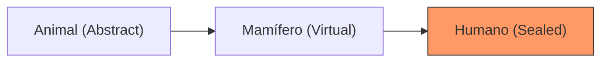

- [2. Modelado de Jerarquías y Abstracción](#2-modelado-de-jerarquías-y-abstracción)
  - [2.1 Clases abstractas y métodos abstractos](#21-clases-abstractas-y-métodos-abstractos)
    - [Conceptos Clave](#conceptos-clave)
  - [2.2 Métodos virtuales y redefinición](#22-métodos-virtuales-y-redefinición)
    - [Métodos virtuales (`virtual` y `override`)](#métodos-virtuales-virtual-y-override)
    - [Ocultación con `new` (NO es sobrescritura)](#ocultación-con-new-no-es-sobrescritura)
    - [Tipos de retorno covariantes](#tipos-de-retorno-covariantes)
  - [2.3 Jerarquía Sellada](#23-jerarquía-sellada)
    - [¿Qué es una jerarquía sellada?](#qué-es-una-jerarquía-sellada)
    - [¿Para qué se usa este patrón?](#para-qué-se-usa-este-patrón)
    - [Ejemplo: Modelando Tipos de Vehículos con una Jerarquía Sellada](#ejemplo-modelando-tipos-de-vehículos-con-una-jerarquía-sellada)
    - [Manejo exhaustivo con `switch` y pattern matching](#manejo-exhaustivo-con-switch-y-pattern-matching)
      - [1. Clases Separadas (`internal sealed`)](#1-clases-separadas-internal-sealed)
      - [2. Clases Anidadas (*Inner*)](#2-clases-anidadas-inner)
  - [2.4 Herencia en la Práctica: Excepciones Personalizadas](#24-herencia-en-la-práctica-excepciones-personalizadas)
    - [¿Por qué crear excepciones propias?](#por-qué-crear-excepciones-propias)
    - [Ejemplo de Implementación](#ejemplo-de-implementación)
  - [2.5 Matiz del Profesor: ¿Cuándo cerrar una jerarquía?](#25-matiz-del-profesor-cuándo-cerrar-una-jerarquía)


# 2. Modelado de Jerarquías y Abstracción

En esta sección exploraremos cómo diseñar jerarquías de clases robustas y coherentes, utilizando la abstracción para definir plantillas generales y la herencia para concretar comportamientos específicos.

---

## 2.1 Clases abstractas y métodos abstractos

Una **clase abstracta** es una clase que no se puede instanciar (no se pueden crear objetos de ella directamente) y que está diseñada para ser una clase base para otras clases. Se utiliza para definir una interfaz común y un comportamiento compartido que deben implementar sus clases derivadas.

Un **método abstracto** es un método declarado en una clase abstracta que no tiene implementación en esa clase. Las clases derivadas que no sean abstractas están obligadas a proporcionar una implementación para todos los métodos abstractos heredados.

### Conceptos Clave

- Una clase con al menos un método abstracto **debe** marcarse como abstracta.
- Sirven como "contrato" o "plantilla" para las subclases.
- Permiten centralizar lógica común mientras delegan los detalles específicos a los hijos.

---

## 2.2 Métodos virtuales y redefinición

A diferencia de los métodos abstractos, los **métodos virtuales** tienen una implementación en la clase base, pero permiten que las clases derivadas los modifiquen.

### Métodos virtuales (`virtual` y `override`)

- **`virtual`**: Indica en la clase base que este método *puede* ser sobrescrito.
- **`override`**: Se usa en la clase derivada para proporcionar la nueva lógica.

### Ocultación con `new` (NO es sobrescritura)

Si definimos un método en la hija con el mismo nombre que el padre pero sin usar `override` (usando `new`), estamos **ocultando** el método del padre. La diferencia es sutil pero crítica: el polimorfismo dejará de funcionar para ese método.

### Tipos de retorno covariantes

Desde C# 9.0, un método sobrescrito puede devolver un tipo más específico que el método de la clase base. Esto mejora la expresividad y seguridad del código.

```csharp
public abstract class Creador
{
    public abstract Animal Crear();
}

public class CreadorDePerros : Creador
{
    // Devuelve Perro en lugar de Animal
    public override Perro Crear() => new Perro(); 
}
```

---

## 2.3 Jerarquía Sellada

### ¿Qué es una jerarquía sellada?

Una **jerarquía sellada** es un diseño donde controlamos exactamente qué clases pueden heredar de una base. En C#, esto se logra marcando las clases finales como `sealed`.

### ¿Para qué se usa este patrón?

1.  **Seguridad**: Evitas que otros programadores extiendan clases que no están preparadas para ello.
2.  **Rendimiento**: El compilador puede optimizar mejor las llamadas a métodos en clases selladas.
3.  **Claridad**: Define un conjunto finito de posibilidades, ideal para el modelado de dominio.

### Ejemplo: Modelando Tipos de Vehículos con una Jerarquía Sellada

```csharp
public abstract class Vehiculo { }

public sealed class Coche : Vehiculo { }
public sealed class Moto : Vehiculo { }
public sealed class Camion : Vehiculo { }
```

### Manejo exhaustivo con `switch` y pattern matching

Al tener una jerarquía sellada, podemos usar `switch` para gestionar todos los tipos posibles de forma segura.

```csharp
public void DescribirVehiculo(Vehiculo vehiculo)
{
    switch (vehiculo)
    {
        case Coche coche:
            Console.WriteLine("Es un coche.");
            break;
        case Moto moto:
            Console.WriteLine("Es una moto.");
            break;
        case Camion camion:
            Console.WriteLine("Es un camión.");
            break;
        default:
            throw new ArgumentException("Tipo de vehículo desconocido.");
    }
}
```

#### 1. Clases Separadas (`internal sealed`)
Uso de modificadores para limitar la herencia al ensamblado actual.

#### 2. Clases Anidadas (*Inner*)
Definir las clases derivadas dentro de la base para una cohesión total.

---

## 2.4 Herencia en la Práctica: Excepciones Personalizadas

### ¿Por qué crear excepciones propias?

Crear tus propias clases de excepción (heredando de `Exception`) permite:
- Capturar errores específicos de tu aplicación de forma diferenciada.
- Añadir información extra al objeto de error.
- Mejorar la legibilidad del bloque `catch`.

### Ejemplo de Implementación

```csharp
public class EdadInvalidaException : Exception
{
    public int EdadIntento { get; }
    public EdadInvalidaException(int edad) 
        : base($"La edad {edad} no es válida.") 
    {
        EdadIntento = edad;
    }
}

public void RegistrarUsuario(string nombre, int edad)
{
    if (edad < 0 || edad > 120)
    {
        throw new EdadInvalidaException(edad);
    }
    // Lógica de registro...
}
```

---

## 2.5 Matiz del Profesor: ¿Cuándo cerrar una jerarquía?

El uso de `sealed` no es solo por seguridad, sino por **diseño semántico**. 
*   **Clase Abstracta**: Es una "promesa" de comportamiento.
*   **Clase Sellada**: Es el "punto final". Indica que la lógica es completa y no debe ser alterada.


