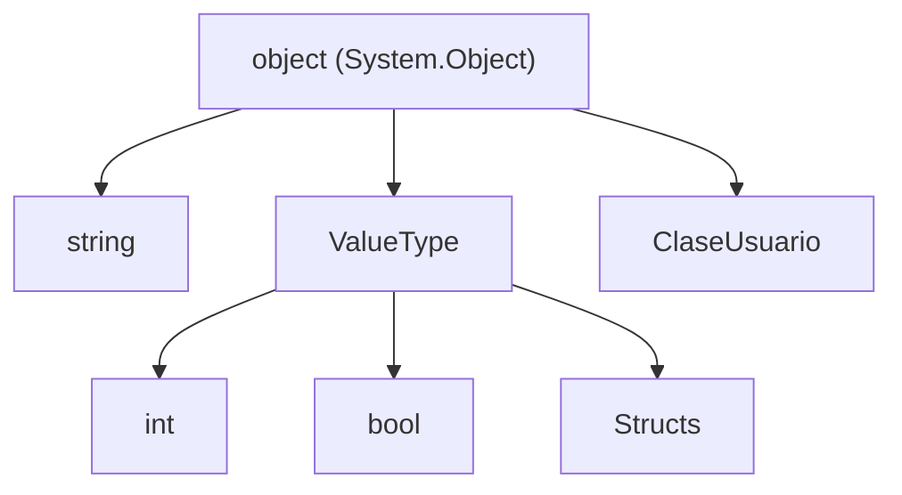

- [3. Tipado y Datos](#3-tipado-y-datos)
  - [3.1 El tipo `object` en C#](#31-el-tipo-object-en-c)
    - [¿Por qué es importante el tipo `object`?](#por-qué-es-importante-el-tipo-object)
    - [Jerarquía Universal](#jerarquía-universal)
    - [Ejemplo:](#ejemplo)
  - [3.2 Tipos especiales: struct, class, record](#32-tipos-especiales-struct-class-record)
    - [Tabla Comparativa Definitiva](#tabla-comparativa-definitiva)
    - [Ejemplo](#ejemplo-1)
  - [3.3 objects vs dynamic](#33-objects-vs-dynamic)
    - [Comparativa: Object vs Dynamic](#comparativa-object-vs-dynamic)
    - [Uso de `object`](#uso-de-object)
    - [Uso de `dynamic`](#uso-de-dynamic)


# 3. Tipado y Datos

En C#, todo es un objeto, pero no todos los objetos son iguales. En esta sección exploraremos la raíz del sistema de tipos, las diferencias fundamentales entre estructuras de datos y cuándo usar tipado dinámico.

---

## 3.1 El tipo `object` en C#

El tipo **`System.Object`** (o su alias `object`) es la clase base definitiva de todas las clases en C#. Absolutamente todos los tipos, incluso los primitivos como `int` o `bool`, heredan directa o indirectamente de `object`.

### ¿Por qué es importante el tipo `object`?

1.  **Polimorfismo Universal**: Permite que una variable de tipo `object` pueda almacenar una referencia a cualquier objeto. Esto es útil para crear colecciones que contengan diferentes tipos de datos.
2.  **Jerarquía Universal**: Al ser la raíz de todos los tipos, garantiza una estructura coherente en el lenguaje.
3.  **Métodos Estándar**: Proporciona métodos básicos que toda clase debe tener:
    - `Equals(object)`: Para comparar si dos objetos son iguales.
    - `GetHashCode()`: Para obtener un código hash único del objeto.
    - `ToString()`: Para obtener la representación en texto del objeto (por defecto el nombre del tipo).
    - `GetType()`: Para conocer el tipo exacto en tiempo de ejecución.

### Jerarquía Universal



### Ejemplo:

```csharp
object obj = "Hola";
Console.WriteLine(obj.GetType()); // Imprime System.String
obj = 10;
Console.WriteLine(obj.GetType()); // Imprime System.Int32
```

---

## 3.2 Tipos especiales: struct, class, record

Aunque todos heredan de `object`, la gestión en memoria y la semántica de uso cambian drásticamente.

- **`class` (Clase)**: Es un tipo de referencia. Se almacena en el **Heap**. La variable contiene la dirección de memoria. La copia de una clase copia la referencia (alias).
- **`struct` (Estructura)**: Es un tipo de valor. Se almacena en el **Stack** (o inline). La copia de un struct crea una copia independiente de todos sus datos.
- **`record` (Registro)**: Introducido en C# 9, puede ser de referencia (`record class`) o valor (`record struct`). Su característica principal es que la igualdad se basa en el contenido de sus propiedades, no en la dirección de memoria.

### Tabla Comparativa Definitiva

| Característica | `class` | `struct` | `record` |
| :--- | :--- | :--- | :--- |
| **Tipo de dato** | Referencia (Heap) | Valor (Stack) | Referencia (por defecto) |
| **Igualdad** | Por referencia (Identidad) | Por valor (Contenido) | Por valor (Contenido) |
| **Copia** | Copia de referencia | Copia de valores | Copia de referencia / with |
| **Inmutabilidad** | Opcional | Opcional | Recomendada / Por defecto |
| **Herencia** | Soportada | No soportada | Soportada (record class) |

### Ejemplo

```csharp
public struct Punto { public int X, Y; }
public class Vehiculo { public string Matricula { get; set; } }
public record Persona(string Nombre, int Edad);
```

---

## 3.3 objects vs dynamic

C# es un lenguaje de tipado estático, pero permite flexibilidad mediante el uso de `object` y `dynamic`.

### Comparativa: Object vs Dynamic

- **`object`**: El compilador conoce el tipo base pero no los miembros de la clase real. Es necesario realizar un **casting** para acceder a ellos. La verificación se hace en **tiempo de compilación**.
- **`dynamic`**: El compilador **no** verifica el tipo en tiempo de compilación. Todo se resuelve en **tiempo de ejecución**. Si intentas usar un método que no existe, el programa fallará al ejecutarse.

### Uso de `object`
```csharp
object obj = "Hola Mundo";
// Console.WriteLine(obj.Length); // Error de compilación: object no tiene Length
Console.WriteLine(((string)obj).Length); // OK: casting explícito
```

### Uso de `dynamic`
```csharp
dynamic d = "Hola Mundo";
Console.WriteLine(d.Length); // OK: el compilador confía en que existirá en ejecución
```

---

## 3.4 Matiz del Profesor: ¿Cuándo usar cada uno?

*   Usa **`struct`** para datos pequeños, matemáticos e inmutables.
*   Usa **`class`** para entidades con identidad propia y comportamiento complejo.
*   Usa **`record`** para modelos de datos (DTOs) que viajan por tu arquitectura y necesitan igualdad por valor.
*   Usa **`dynamic`** solo cuando sea estrictamente necesario, como al trabajar con objetos JSON de estructura desconocida o interoperabilidad con otros lenguajes.
