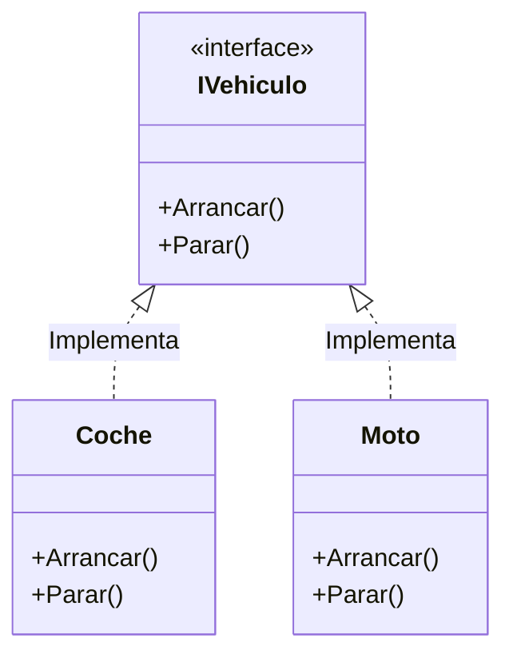
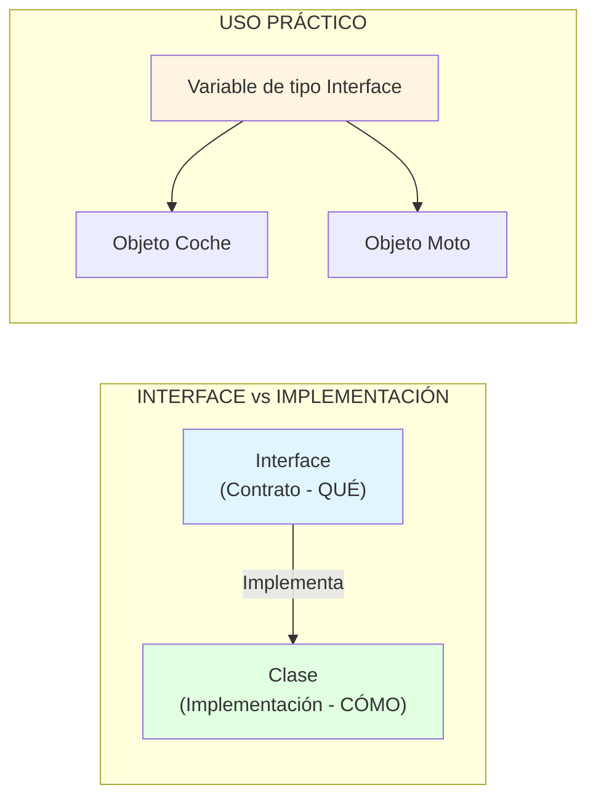

- [4. Interfaces](#4-interfaces)
  - [4.1. Definición y propósito](#41-definición-y-propósito)
  - [4.2. Ejemplo básico de interface y uso como tipo](#42-ejemplo-básico-de-interface-y-uso-como-tipo)
  - [4.3. Implementación de múltiples interfaces](#43-implementación-de-múltiples-interfaces)
  - [4.4. Herencia múltiple de interfaces](#44-herencia-múltiple-de-interfaces)
  - [4.5. Métodos y propiedades por defecto en interfaces](#45-métodos-y-propiedades-por-defecto-en-interfaces)
  - [4.6. Uso de interfaces para tipar](#46-uso-de-interfaces-para-tipar)
  - [4.7. ¿Qué ocurre si dos interfaces declaran el mismo método?](#47-qué-ocurre-si-dos-interfaces-declaran-el-mismo-método)       
    - [Caso 1: Conflicto, **misma firma**, sin implementación por defecto](#caso-1-conflicto-misma-firma-sin-implementación-por-defecto)
    - [Caso 2: **Firma igual, métodos por defecto distintos**](#caso-2-firma-igual-métodos-por-defecto-distintos)
    - [Solución: Implementación explícita y alias de interface](#solución-implementación-explícita-y-alias-de-interface)
  - [4.8. Uso de Herencia e Interfaces juntos](#48-uso-de-herencia-e-interfaces-juntos)
  - [4.9. Resumen de ventajas y mejores prácticas](#49-resumen-de-ventajas-y-mejores-prácticas)


# 4. Interfaces

## 4.1. Definición y propósito

Una **interface** en C# es un contrato que define **métodos**, **propiedades**, **eventos** o **indexadores**, pero no su implementación (al menos hasta C# 7.x). Una clase o struct que implementa una interface debe proporcionar una implementación para todos los miembros definidos en la interface (salvo que la interface ofrezca implementación por defecto a partir de C# 8).

Se puede decir que una interface es un conjunto de reglas que una clase debe seguir si decide "firmar" ese contrato y estar de acuerdo con él y obligarse a cumplirlo.



a su vez, es un mecanismo fundamental para lograr **abstracción**, **polimorfismo múltiple** y **desacoplamiento** en el diseño de software, y para simular la herencia múltiple en C#.

*   **Las interfaces permiten:**
    *   Definir “lo que algo puede hacer” sin establecer cómo lo hace.
    *   El polimorfismo múltiple: una clase puede implementar varias interfaces, heredando comportamientos de distintos "contratos". Lo que no es posible con la herencia de clases.
    *   La programación orientada a interfaces en vez de a clases: tu código depende de contratos, no de implementaciones concretas.
    *   Tipar variables y colecciones, facilitando la reutilización y pruebas unitarias.
    *   Puede obligar a una clase a implementar un método estático (como un operador + o un Crear()).

---

## 4.2. Ejemplo básico de interface y uso como tipo

*   Al contrario que una clase, una interface no puede contener campos ni constructores.
*   Los miembros de una interface son **públicos por defecto** y no pueden tener modificadores de acceso.
*   Una interface no puede ser instanciada directamente.
*   Una clase implementa una interface usando el operador `:` y debe implementar todos sus miembros.
*   Los métodos de una interfaz no necesitan ser marcados con `virtual` o `abstract`. Esto es implícito.
*   Una clase puede implementar múltiples interfaces separándolas con comas.
*   Las interfaces pueden heredar de otras interfaces y permiten herencia múltiple entre interfaces.
*   La implementaciones de métodos en la clase de una interfaz no tiene que usar `override`, ya que no hay implementación previa.
*   **Sirven como tipos**: puedes declarar variables, parámetros o colecciones de tipo interface.

```csharp
public interface IVehiculo
{
 void Arrancar();
 void Parar();
 // Obligas a la clase a tener este método estático
 static abstract bool Crear();
}

public class Coche : IVehiculo
{
 public void Arrancar() => Console.WriteLine("El coche arranca");
 public void Parar() => Console.WriteLine("El coche para");
 public static bool Crear() => true; // Implementación del método estático
}


Vehiculo vehiculo = new Coche();
vehiculo.Arrancar(); // "El coche arranca"
vehiculo.Parar(); // "El coche para"
Vehiculo.Crear(); // true

// Uso como tipo (TIPADO), lo veremos más adelante
IVehiculo miVehiculo = new Coche();
miVehiculo.Arrancar(); // "El coche arranca"
miVehiculo.Parar(); // "El coche para"
```

**Nota:**
Aunque la variable es de tipo `IVehiculo`, la llamada a los métodos invoca la implementación de la clase concreta (`Coche`). Así puedes intercambiar clases fácilmente.

---

## 4.3. Implementación de múltiples interfaces

Una clase puede implementar varias interfaces:

```csharp
public interface IElectric
{
 void Recargar();
}

public class CocheElectrico : IVehiculo, IElectric
{
 public void Arrancar() => Console.WriteLine("Arranca el coche eléctrico");
 public void Parar() => Console.WriteLine("Para el coche eléctrico");
 public void Recargar() => Console.WriteLine("Recarga...");
}
```

Esto permite mezclar distintos "contratos" en una misma clase.

---

## 4.4. Herencia múltiple de interfaces

Una interface puede heredar de múltiples interfaces:

```csharp
public interface IVehiculoTerrestre
{
 void Conducir();
}
public interface IVehiculoAereo
{
 void Volar();
}

public interface IVehiculoHibrido : IVehiculoTerrestre, IVehiculoAereo
{
 void CambiarModo();
}

public class AvionCoche : IVehiculoHibrido
{
 public void Conducir() => Console.WriteLine("Conduciendo en tierra");
 public void Volar() => Console.WriteLine("Volando en el aire");
 public void CambiarModo() => Console.WriteLine("Cambiando modo entre tierra y aire");
}
```

---

## 4.5. Métodos y propiedades por defecto en interfaces

Desde C#, se pueden proporcionar implementaciones por defecto para métodos y propiedades en interfaces.
Esto significa que si una clase no implementa explícitamente ese método, usará la versión por defecto de la interface (pero **puede** sobrescribirla si lo desea).

```csharp
public interface IVehiculo
{
 void Arrancar();
 void Parar()
 {
 Console.WriteLine("Parando de forma genérica (por defecto)");
 }
}

public class Patinete : IVehiculo
{
 public void Arrancar() => Console.WriteLine("El patinete arranca");
 // Parar() no implementado: usará el de IVehiculo
}

Patinete p = new Patinete();
p.Arrancar(); // "El patinete arranca"
p.Parar(); // "Parando de forma genérica (por defecto)"
```

---

## 4.6. Uso de interfaces para tipar

Una de las ventajas más poderosas de las interfaces en C# es poder usarlas como **tipo de variables, listas o argumentos**, para desacoplar tu código:

```csharp
public interface IAnimal
{
 void HacerSonido();
}

public class Perro : IAnimal
{
 public void HacerSonido() => Console.WriteLine("Guau guau");
}

public class Gato : IAnimal
{
 public void HacerSonido() => Console.WriteLine("Miau miau");
}

public void HacerSonarAnimal(IAnimal animal)
{
 animal.HacerSonido();
}

Animal[] animales = { new Perro(), new Gato() };

foreach (IAnimal a in animales)
{
 HacerSonarAnimal(a); // Polimorfismo: cada animal suena diferente
}
```

Esto hace que tu código sea flexible, ampliable y fácil de mantener o testear.

---

## 4.7. ¿Qué ocurre si dos interfaces declaran el mismo método?

### Caso 1: Conflicto, **misma firma**, sin implementación por defecto

```csharp
public interface IZumbador
{
 void Arrancar();
}
public interface IVehiculo
{
 void Arrancar();
}

public class Coche : IVehiculo, IZumbador
{
 // Una sola implementación: sirve a ambas interfaces
 public void Arrancar() => Console.WriteLine("Arranca según ambos contratos");
}
```

*El método implementado sirve para las dos interfaces porque la firma es igual.*

### Caso 2: **Firma igual, métodos por defecto distintos**

```csharp
public interface IA
{
 void Muestra() => Console.WriteLine("Muestra IA");
}
public interface IB
{
 void Muestra() => Console.WriteLine("Muestra IB");
}

public class Demo : IA, IB
{
 // No se implementa Muestra aquí
}

Demo d = new Demo();
// d.Muestra(); // Error, ambigüedad
```

**Esto produce ambigüedad:**
- Si llamas a `d.Muestra()`, el compilador da error pues no sabe cuál coger.
- Puedes **usar alias explícito** para seleccionar qué implementación quieres invocar.

### Solución: Implementación explícita y alias de interface

```csharp
public class Demo : IA, IB
{
 void IA.Muestra() => Console.WriteLine("Muestra IA (alias)");
 void IB.Muestra() => Console.WriteLine("Muestra IB (alias)");
}

Demo d = new Demo();
((IA)d).Muestra(); // "Muestra IA (alias)"
((IB)d).Muestra(); // "Muestra IB (alias)"
```

**Nota:**
- Las implementaciones explícitas sólo pueden ser llamadas mediante conversión al interface correspondiente.

---

## 4.8. Uso de Herencia e Interfaces juntos

Cuando una clase hereda de otra y además implementa interfaces, la jerarquía se vuelve más compleja pero también más flexible y debemos conocer las reglas, asi como su sistema de resolución de métodos. ¿Qué se suele poner primero después de los dos puntos (`:`)? Siempre la clase base primero (herencia simple), luego las interfaces (implementación múltiple).

```csharp
public class Vehiculo
{
 public virtual void Arrancar() => Console.WriteLine("Vehículo arrancando");
}

public interface IZumbador
{
 void Arrancar();
}

public class Coche : Vehiculo, IZumbador
{
 public override void Arrancar() => Console.WriteLine("Coche arrancando");
 // Implementación de IZumbador no es necesaria si la firma coincide
}
```

¿Qué pasa si hay una ambigüedad entre la clase base y la interface? La clase base tiene prioridad o las dos tiene una implementación por defecto distinta? Se puede usar alias explícito para resolverlo.

```csharp
public interface IA
{
 void Muestra() => Console.WriteLine("Muestra IA");
}
public class Base
{
 public virtual void Muestra() => Console.WriteLine("Muestra Base");
}

public class Derivada : Base, IA
{
 // No se implementa Muestra aquí
}
Derivada d = new Derivada();
d.Muestra(); // "Muestra Base" (la clase base tiene prioridad)
```

// Si quieres llamar a la versión de IA, debes usar alias explícito:
```csharp
((IA)d).Muestra(); // "Muestra IA"
```

---

## 4.9. Resumen de ventajas y mejores prácticas

- Las interfaces permiten una programación orientada a contratos.
- Facilitan el polimorfismo y el desacoplamiento del código.
- Permiten usar métodos por defecto para mantener la compatibilidad hacia atrás y evolucionar APIs.
- Si dos interfaces tienen métodos con la misma firma, se puede usar una única implementación (si no hay conflicto de implementación por defecto) o alias con implementación explícita.
- ¡Se usan para "tipar" variables, colecciones y argumentos, permitiendo máxima flexibilidad!

> 📝 **Nota del Profesor:** "Interface" en POO = "Contrato" en la vida real. Cuando contratas un seguro, firmas un contrato que dice qué hace la aseguradora y qué haces tú. Las interfaces funcionan igual: definen qué métodos debe tener una clase, sin decir cómo implementarlos.



> 💡 **Tip de diseño:** Regla de oro para interfaces:
> - **Nombres descriptivos**: `IPaginable`, `IOrdenable`, `IBuscable` (terminan en "ble")
> - **Interfaces pequeñas**: Mejor muchas interfaces específicas que una gigante
> - **Inversión de dependencia**: "Depende de abstracciones, no de concreciones"

```csharp
// EJEMPLO COMPLETO: Sistema de notificaciones desacoplado
public interface INotificable
{
    void Enviar(string mensaje);
}

public interface IEmailSender
{
    void SendEmail(string to, string subject, string body);
}

// Implementaciones concretas
public class EmailNotificacion : INotificable
{
    private readonly IEmailSender _emailSender;
    
    public EmailNotificacion(IEmailSender emailSender)  // DIP
    {
        _emailSender = emailSender;
    }
    
    public void Enviar(string mensaje) => 
        _emailSender.SendEmail("cliente@email.com", "Notificación", mensaje);
}

public class SMSNotificacion : INotificable
{
    public void Enviar(string mensaje) => 
        Console.WriteLine($"SMS enviado: {mensaje}");
}

// El código alto nivel depende de la ABSTRACCIÓN, no de la implementación
public class GestorNotificaciones
{
    private readonly INotificable _notificador;
    
    // Inyección de dependencia - flexibility total
    public GestorNotificaciones(INotificable notificador)
    {
        _notificador = notificador;
    }
    
    public void NotifyAll(string msg) => _notificador.Enviar(msg);
}

// Uso:
var emailService = new EmailNotificacion(new OutlookSender());
var gestor1 = new GestorNotificaciones(emailService);

var smsService = new SMSNotificacion();
var gestor2 = new GestorNotificaciones(smsService);
// ¡Puedo cambiar el comportamiento sin modificar GestorNotificaciones!
```

> 📝 **Pregunta de examen:** ¿Por qué usar `INotificable` en lugar de `EmailNotificacion` directamente?
> **Respuesta:** Para poder cambiar la implementación (SMS, Push, Slack) sin modificar el código que usa el notificador. Esto es el **Principio de Inversión de Dependencia (DIP)** de SOLID.
