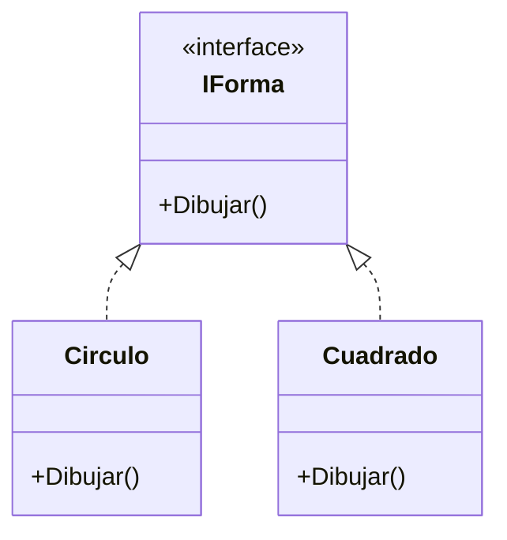
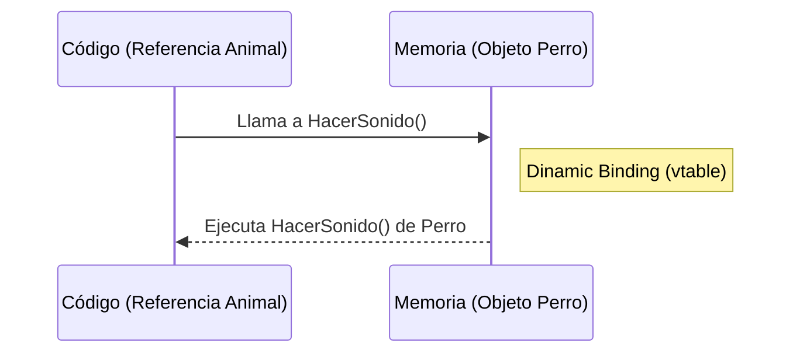
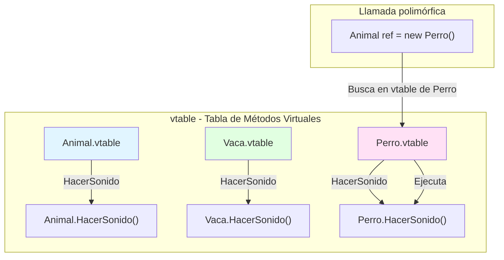

- [5. Polimorfismo](#5-polimorfismo)
  - [5.1 Polimorfismo por herencia](#51-polimorfismo-por-herencia)
  - [5.2 Polimorfismo con interfaces](#52-polimorfismo-con-interfaces)
  - [5.3 Casting y comprobación de tipos para polimorfismo seguro](#53-casting-y-comprobación-de-tipos-para-polimorfismo-seguro)
    - [Casting explícito](#casting-explícito)
    - [Casting seguro `as`](#casting-seguro-as)
    - [Comprobación de tipos con `is` y pattern matching](#comprobación-de-tipos-con-is-y-pattern-matching)
  - [5.4 Polimorfismo en Colecciones y Métodos](#54-polimorfismo-en-colecciones-y-métodos)


# 5. Polimorfismo

El **polimorfismo** permite que diferentes clases respondan de manera distinta a la misma interfaz o método. Esto se logra principalmente mediante la herencia y las interfaces. ¿Por qué es útil? Porque permite escribir código más flexible y reutilizable.

De esta manera **en tiempo de ejecución, el método que se ejecuta depende del tipo real del objeto, no del tipo de la referencia**.

Es decir, puedes tener una variable de tipo base o interface que apunte a objetos de diferentes clases derivadas, y al llamar a un método, se ejecutará la versión correspondiente a la clase real del objeto.

Una de las ventajas es poder tener colecciones y/o métodos que trabajen con tipos más generales, y el comportamiento específico se determina en tiempo de ejecución.

> **Analogía:** Es como un mando universal. El botón "Encender" funciona para la TV, el DVD y el Aire Acondicionado, pero cada uno reacciona de forma distinta. Tú solo pulsas "Encender" (la interfaz), y el dispositivo (el objeto) sabe qué hacer.



¿Por qué funciona? Pues en tiempo de ejecución se resuelve el método correcto mediante una tabla de métodos virtuales (vtable) que asocia cada clase con sus implementaciones y con ello se consigue el comportamiento polimórfico.

Diferencia entre sobrecarga (compile-time) y polimorfismo (run-time):
- **Sobrecarga de métodos:** Mismo nombre, diferentes parámetros. Resuelto en tiempo de compilación.
- **Polimorfismo:** Mismo método, diferentes implementaciones. Resuelto en tiempo de ejecución.

La herencia se resuelve en tiempo de compilación, pero el polimorfismo en tiempo de ejecución. Es decir se hereda siempre de arriba abajo, es jerárquica (va bajando por el árbol). Si necesito saber quien tiene un método o propiedad, subo por el arboil hasta encontrarlo.

La ligadura dinámica (dynamic binding) es el mecanismo que permite que la llamada a un método se resuelva en tiempo de ejecución, basándose en el tipo real del objeto. ¿Cómo funciona? Cuando se llama a un método virtual, el sistema busca en la vtable del objeto para encontrar la implementación correcta según su tipo real. Es decir recorre el árbol de herencia para encontrar la implementación más específica (de abajo a arriba, va subiendo).



## 5.1 Polimorfismo por herencia

```csharp
class Animal
{
    public virtual void HacerSonido() => Console.WriteLine("El animal hace un sonido");
}

class Vaca : Animal
{
    public override void HacerSonido() => Console.WriteLine("Muuuu");
}

class Perro : Animal
{
    public override void HacerSonido() => Console.WriteLine("Guau guau");
}

class Gato : Animal
{
    public override void HacerSonido() => Console.WriteLine("Miau miau");
}


Animal[] animales = {
    new Vaca(), new Perro(), new Gato()
};

foreach (Animal a in animales)
{
    a.HacerSonido(); // Cada animal ejecuta su propio método, dependiendo de su tipo real (Vaca, Perro, Gato)
}
```

## 5.2 Polimorfismo con interfaces

```csharp
public interface IPintable
{
    void Pintar();
}

public class Coche : IPintable
{
    public void Pintar() => Console.WriteLine("Pintando coche");
}
public class Casa : IPintable
{
    public void Pintar() => Console.WriteLine("Pintando casa");
}

IPintable[] objetos = {
    new Coche(),
    new Casa()
};

foreach (IPintable obj in objetos)
{
    obj.Pintar(); // Cada objeto ejecuta su propio método Pintar
}
```

---

## 5.3 Casting y comprobación de tipos para polimorfismo seguro

A la hora de trabajar con polimorfismo, a veces es necesario convertir (cast) una referencia de un tipo base o interface a un tipo derivado específico para acceder a miembros particulares de la clase derivada. ¿Por qué? Porque el tipo base o interface no conoce esos miembros específicos. Si trabajamos con un enfoque "general" necesitamos asegurarnos de que el objeto realmente es del tipo esperado antes de hacer el cast, para evitar errores en tiempo de ejecución.

### Casting explícito

```csharp
class Vehiculo { 
    public string Marca { get; set; }
    public string Modelo { get; set; }
    public Vehiculo(string marca, string modelo)
    {
        Marca = marca;
        Modelo = modelo;
    }
}

class Coche : Vehiculo
{
    public string Color { get; set; }
    public Coche(string marca, string modelo, string color)
        : base(marca, modelo)
    {
        Color = color;
    }
    public void Arrancar() => Console.WriteLine("Coche arrancado");
}

Vehiculo v = new Coche("Seat", "Ibiza", "Rojo");

// V que es? Es un Vehiculo, pero en realidad es un Coche, pero como Vehiculo no tiene Arrancar(), como lo hacemos?
Coche c = (Coche)v; // Funciona si v es realmente un Coche y si no lanza InvalidCastException
c.Arrancar(); // "Coche arrancado"
```

### Casting seguro `as`
Este operador intenta convertir y si no puede, devuelve `null` en vez de lanzar excepción. Es útil para evitar errores en tiempo de ejecución. A su vez permite comprobar si la conversión fue exitosa.

```csharp
Vehiculo v = new Moto("Ducati", "Monster", "Negro");
Coche c = v as Coche;
if (c != null)
    c.Arrancar();
else
    Console.WriteLine("El vehículo no es un coche");
```

### Comprobación de tipos con `is` y pattern matching
El operador `is` permite comprobar si un objeto es de un tipo específico antes de hacer un cast. Desde C# 7, se puede usar junto con pattern matching para simplificar el código.

```csharp
if (v is Moto m)
{
    m.Arrancar();
}
```

**Pattern Matching en C# 14** (patrones de tipo, de propiedades...)
Nos permite hacer comprobaciones más complejas y específicas de tipos, por ejemplo comprobar si un objeto es de un tipo concreto y además cumple ciertas condiciones en sus propiedades.

```csharp
// Estamos comprobando si v es un Coche y además su Color es "Rojo"
if (v is Coche { Color: "Rojo" })
{
    Console.WriteLine("¡Este coche es rojo!");
}
```

**Contraejemplo:**  
Nunca hacer un cast directo si no sabes el tipo real:

```csharp
Coche c = (Coche)v; // Si v no es Coche, lanza InvalidCastException
```

---
## 5.4 Polimorfismo en Colecciones y Métodos
Siempre que trabajes con colecciones o métodos que acepten tipos base o interfaces, el polimorfismo te permitirá manejar distintos tipos derivados sin cambiar el código. Para empezar siempre define la colección con el tipo base o interface, de esta manera puedes añadir cualquier objeto que implemente esa interface o herede de esa clase base.

Luego usa polimorfismo para llamar a los métodos adecuados en tiempo de ejecución usando el tipo real del objeto y usando un casting seguro si es necesario.

```csharp
interface IForma
{
    double Area();
}

class Circulo : IForma
{
    public double Radio { get; set; }
    public Circulo(double radio) => Radio = radio;
    public double Area() => Math.PI * Radio * Radio;
}

class Rectangulo : IForma
{
    public double Ancho { get; set; }
    public double Alto { get; set; }
    public Rectangulo(double ancho, double alto)
    {
        Ancho = ancho;
        Alto = alto;
    }
    public double Area() => Ancho * Alto;
    public double Perimetro() => 2 * (Ancho + Alto);
}

IForma[] formas = {
    new Circulo(5),
    new Rectangulo(4, 6)
};

foreach (IForma forma in formas)
{
    Console.WriteLine($"Área: {forma.Area()}"); // Cada forma calcula su área según su tipo real
    if (forma is Rectangulo r)
    {
        Console.WriteLine($"Perímetro: {r.Perimetro()}"); // Accedemos a Perímetro sólo si es Rectángulo
    }
}
```

> 📝 **Truco del Examinador:** Pregunta típica de examen: "¿Qué diferencia hay entre `is` y `as`?"
> - **`is`**: Solo comprueba, no convierte. Devuelve `true`/`false`.
> - **`as`**: Intenta convertir y devuelve `null` si falla. Más seguro porque evita excepciones.

> 💡 **Analogía del casting:** Imagina que tienes una caja misteriosa (tipo base). Sabes que dentro hay algo, pero no sabes qué. Usar `is` es como abrir la caja para mirar antes de tocar. Usar `as` es como intentar agarrar algo; si no hay nada o no es lo que esperabas, tu mano vuelve vacía (null) en lugar de explotar.

```csharp
// EJEMPLO COMPLETO: Sistema de figuras geométricas con polimorfismo
public abstract class Figura
{
    public string Color { get; set; }
    public abstract double CalcularArea();
    public virtual string Descripcion() => $"Figura de color {Color}";
}

// Polimorfismo por herencia
public class Circulo : Figura
{
    public double Radio { get; set; }
    public override double CalcularArea() => Math.PI * Radio * Radio;
    public override string Descripcion() => $"Círculo {Color} de radio {Radio}";
}

public class Rectangulo : Figura
{
    public double Ancho { get; set; }
    public double Alto { get; set; }
    public override double CalcularArea() => Ancho * Alto;
}

// Polimorfismo por interfaz
public interface IExportable
{
    string Exportar();
}

public class CirculoExportable : Circulo, IExportable
{
    public string Exportar() => $"CIRCULO|{Color}|{Radio}";
}

public class RectanguloExportable : Rectangulo, IExportable
{
    public string Exportar() => $"RECTANGULO|{Color}|{Ancho}x{Alto}";
}

// Demostración de polimorfismo
Figura[] figuras = {
    new Circulo { Color = "Rojo", Radio = 5 },
    new Rectangulo { Color = "Azul", Ancho = 4, Alto = 6 }
};

IExportable[] exportables = {
    new CirculoExportable { Color = "Verde", Radio = 3 },
    new RectanguloExportable { Color = "Amarillo", Ancho = 2, Alto = 8 }
};

foreach (var fig in figuras)
{
    Console.WriteLine($"{fig.Descripcion()} - Área: {fig.CalcularArea():F2}");
}
// Salida:
// Círculo Rojo de radio 5 - Área: 78.54
// Figura de color Azul - Área: 24.00

foreach (var exp in exportables)
{
    Console.WriteLine(exp.Exportar());
}
// Salida:
// CIRCULO|Verde|3
// RECTANGULO|Amarillo|2x8
```



> 📝 **Nota técnica:** La **vtable** (virtual method table) es una estructura de datos que el compilador crea automáticamente para cada clase que tiene métodos `virtual`. Cada entrada de la vtable contiene un puntero a la implementación del método. Cuando llamas a un método virtual, el runtime sigue el puntero correcto según el tipo real del objeto.

> 💡 **Tip de rendimiento:** El polimorfismo tiene un pequeño coste (lookup en la vtable), pero es insignificante comparado con los beneficios de diseño. Solo lo optimizarías en escenarios de rendimiento extremo (millones de llamadas por segundo).
```
