- [6. Arquitectura y Diseño](#6-arquitectura-y-diseño)
  - [6.1. Herencia vs Composición](#61-herencia-vs-composición)
    - [Conceptos fundamentales](#conceptos-fundamentales)
      - [Herencia (`IS-A` o "Es un")](#herencia-is-a-o-es-un)
      - [Composición (`HAS-A` o "Tiene un")](#composición-has-a-o-tiene-un)
    - [Pros y contras de la Herencia](#pros-y-contras-de-la-herencia)
    - [Pros y contras de la Composición](#pros-y-contras-de-la-composición)
    - [¿Por qué la composición suele ser preferible en el diseño moderno?](#por-qué-la-composición-suele-ser-preferible-en-el-diseño-moderno)
      - [Herencia puede ser un antipatrón cuando:](#herencia-puede-ser-un-antipatrón-cuando)
    - [Ejemplo comparativo y con interfaces](#ejemplo-comparativo-y-con-interfaces)
      - [Ejemplo de herencia (IS-A):](#ejemplo-de-herencia-is-a)
      - [Ejemplo de composición (HAS-A):](#ejemplo-de-composición-has-a)
    - [Relación entre composición e interfaces](#relación-entre-composición-e-interfaces)
  - [6.2. Principios SOLID (explicaciones y ejemplos reales)](#62-principios-solid-explicaciones-y-ejemplos-reales)
    - [Resumen Visual](#resumen-visual)
    - [S - Single Responsibility Principle (Responsabilidad Única)](#s---single-responsibility-principle-responsabilidad-única)
    - [O - Open/Closed Principle (Abierto/Cerrado)](#o---openclosed-principle-abiertocerrado)
    - [L - Liskov Substitution Principle (Sustitución de Liskov)](#l---liskov-substitution-principle-sustitución-de-liskov)
    - [I - Interface Segregation Principle (Segregación de Interfaces)](#i---interface-segregation-principle-segregación-de-interfaces)
    - [D - Dependency Inversion Principle (Inversión de dependencias)](#d---dependency-inversion-principle-inversión-de-dependencias)
    - [Resumen y guía didáctica](#resumen-y-guía-didáctica)
    - [Ejemplo completo aplicando SOLID](#ejemplo-completo-aplicando-solid)
  - [6.3. Caso Práctico Web: Patrón Repositorio y SOLID](#63-caso-práctico-web-patrón-repositorio-y-solid)
    - [El Problema](#el-problema)
    - [La Solución: El Patrón Repositorio](#la-solución-el-patrón-repositorio)
    - [Código Real](#código-real)


# 6. Arquitectura y Diseño

Escribir código que funcione es fácil; escribir código que perdure es un arte. En esta sección abordaremos cómo estructurar nuestras clases para que sean mantenibles, flexibles y testables.

---

## 6.1. Herencia vs Composición

### Conceptos fundamentales

**Herencia** y **Composición** son los dos principales mecanismos para organizar y reutilizar código en la programación orientada a objetos.
Ambos tienen propósitos distintos y diferentes implicaciones en el mantenimiento, evolución y robustez de tus aplicaciones.

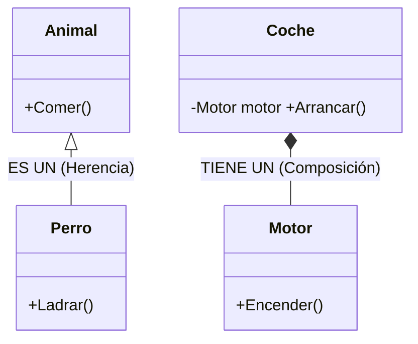

#### Herencia (`IS-A` o "Es un")

- Una clase *hereda* de otra, adquiriendo sus métodos y propiedades.
- Se utiliza para modelar una relación de “tipo”, donde la subclase es una versión especial de la clase base.
- Ejemplo típico: Un `Perro` herede de `Animal` porque un perro **es** un animal.

#### Composición (`HAS-A` o "Tiene un")

- Una clase *contiene* instancias de otras clases.
- Se utiliza para modelar relaciones de “parte”, donde una clase contiene o utiliza otra como funcionalidad interna.
- Ejemplo típico: Un `Coche` tiene un `Motor`, no es un motor, sino que utiliza uno para funcionar.

### Pros y contras de la Herencia

**Ventajas:**
- Fomenta la **reutilización de código**: las subclases pueden usar o sobrescribir métodos y propiedades de la base.
- Permite **polimorfismo**: puedes trabajar con objetos de la clase base y ejecutar métodos sobrescritos de las derivadas.
- Organiza el código en jerarquías lógicas y facilita la extensión de comportamientos.

**Desventajas (y por qué puede ser un anti-patrón):**
- **Acoplamiento fuerte**: las subclases dependen internamente de la implementación de la clase base. Si algo cambia en la base, puede romper muchas derivadas.
- Puede llevar a **jerarquías poco flexibles y difíciles de mantener**, sobre todo si la herencia se utiliza demasiado y sin criterio claro.
- **Frágil para evolución**: pequeño cambio en la base, grandes problemas en toda la jerarquía.
- **Herencia inapropiada**: si la relación no es realmente un IS-A y se fuerza la herencia, tendrás métodos o propiedades sin sentido en la subclase (por ejemplo, hacer que un `Auto` herede de `Motor`).
- **Violación del principio de sustitución de Liskov** si la subclase no puede comportarse como la base (por diseño o por lógica de negocio).
- Añade **complejidad innecesaria** y puede producir el anti-patrón conocido como **God Object** o **jerarquía profunda**.

### Pros y contras de la Composición

**Ventajas:**
- **Desacoplamiento**: las clases utilizan otras clases por sus interfaces, pueden cambiar fácilmente la implementación.
- Promueve la **flexibilidad y extensibilidad**: puedes componer objetos complejos a partir de objetos más simples.
- Facilita la **prueba unitaria y la reutilización**.
- Es base fundamental de la **inyección de dependencias**: puedes inyectar distintos objetos que cumplan la misma interface sin modificar la clase principal.
- Permite **cambiar comportamientos en tiempo de ejecución de forma muy sencilla**.

**Desventajas:**
- A veces requiere **más código de "pegado"** (constructores, setters).
- Si no se implementa bien, puede llevar a objetos muy fragmentados y difíciles de manejar.
- La lógica para establecer las relaciones entre componentes suele ser responsabilidad de otro módulo o patrón (como el **dependency injection container**).

### ¿Por qué la composición suele ser preferible en el diseño moderno?

Actualmente, la composición es el patrón recomendado por la mayoría de expertos en diseño OO por:
- Su flexibilidad, desacoplamiento y extensibilidad.
- Facilita el uso de **principios SOLID**, especialmente el principio de inversión de dependencias.
- Permite cambiar e inyectar colaboradores fácilmente mediante **interfaces**, favoreciendo la evolución y el testeo.

#### Herencia puede ser un antipatrón cuando:
- Se utiliza para reutilizar código “rápido”, en vez de definir una verdadera relación IS-A.
- Se crean jerarquías profundas y arduas de mantener.
- Las subclases se ven obligadas a heredar métodos o propiedades que no tienen sentido para su dominio.

**Regla de oro:**
“Prefiere composición a herencia”, sobre todo cuando no existe una relación clara y real de tipo entre clases.

### Ejemplo comparativo y con interfaces

#### Ejemplo de herencia (IS-A):

```csharp
public class Animal
{
    public virtual void HacerSonido() => Console.WriteLine("Sonido genérico");
}

public class Perro : Animal
{
    public override void HacerSonido() => Console.WriteLine("Guau guau!");
}
```

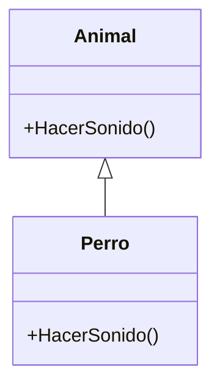

-----------
#### Ejemplo de composición (HAS-A):

```csharp
public class Motor
{
    public void Encender() => Console.WriteLine("Motor encendido");
}
public class Coche
{
    private Motor motor;
    public Coche(Motor motor)
    {
        this.motor = motor; // Inyección de dependencia
    }
    public void Arrancar() => motor.Encender();
}
```

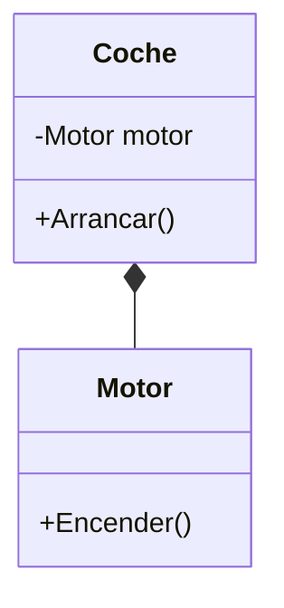

Así, `Coche` puede recibir **distintos motores** con el mismo tipo (por ejemplo, a través de una interface):

```csharp
public interface IMotor
{
    void Encender();
}

public class MotorGasolina : IMotor
{
    public void Encender() => Console.WriteLine("Motor gasolina encendido");
}

public class MotorElectrico : IMotor
{
    public void Encender() => Console.WriteLine("Motor eléctrico encendido");
}

public class Coche
{
    private IMotor motor;
    public Coche(IMotor motor)
    {
        this.motor = motor; // Inyección de dependencia por interface
    }
    public void Arrancar() => motor.Encender();
}
```

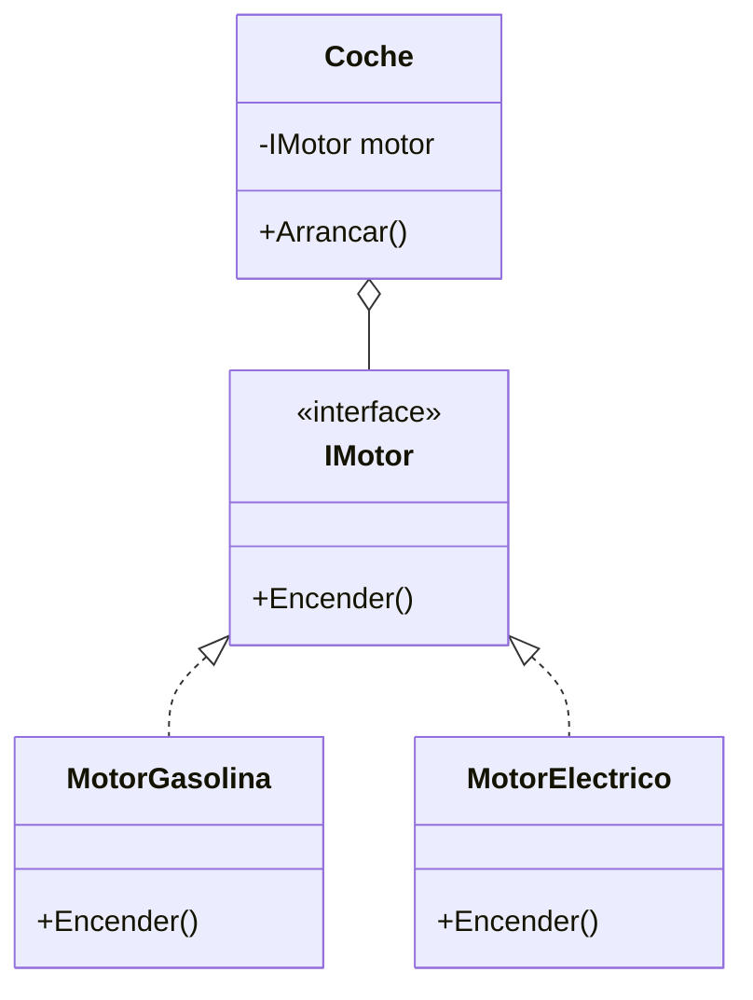

```csharp
Coche coche1 = new Coche(new MotorGasolina());
Coche coche2 = new Coche(new MotorElectrico());
coche1.Arrancar(); // Motor gasolina encendido
coche2.Arrancar(); // Motor eléctrico encendido
```
Esto hace al `Coche` **totalmente desacoplado** de la implementación concreta del motor.

### Relación entre composición e interfaces

- Las interfaces permiten abstraer el comportamiento de los componentes, haciendo que la composición sea aún más poderosa.
- Es la base de muchos patrones de diseño (como **Strategy**, **Decorator** o **Adapter**).
- La combinación de interfaces y composición permite construir aplicaciones modulares y fácilmente extensibles.

---

## 6.2. Principios SOLID (explicaciones y ejemplos reales)

Los principios **SOLID** son la base del diseño profesional en programación orientada a objetos. Aplicarlos te ayuda a crear sistemas **robustos**, **mantenibles**, **flexibles** y **escalables**.
SOLID es un acrónimo de:
- **S**: Single Responsibility Principle (Responsabilidad Única)
- **O**: Open/Closed Principle (Abierto/Cerrado)
- **L**: Liskov Substitution Principle (Sustitución de Liskov)
- **I**: Interface Segregation Principle (Segregación de Interfaces)
- **D**: Dependency Inversion Principle (Inversión de Dependencias)

### Resumen Visual

| Letra | Principio             | Concepto Clave                                        |
| :---: | :-------------------- | :---------------------------------------------------- |
| **S** | Single Responsibility | Una clase, una razón para cambiar.                    |
| **O** | Open/Closed           | Abierto a extensión, cerrado a modificación.          |
| **L** | Liskov Substitution   | Las subclases deben comportarse como sus padres.      |
| **I** | Interface Segregation | Interfaces pequeñas y específicas > Interfaz gigante. |
| **D** | Dependency Inversion  | Depender de abstracciones, no de concreciones.        |

### S - Single Responsibility Principle (Responsabilidad Única)

**Teoría:**
Cada clase debe tener **una sola razón para cambiar**, es decir, debe encargarse de una única responsabilidad dentro del sistema. Si una clase gestiona más de un motivo de cambio, será más difícil de mantener y extender.

**Ejemplo MAL diseñado (violando SRP):**

```csharp
public class Reporte
{
    public void Generar()
    {
        Console.WriteLine("Reporte generado");
    }
    public void Imprimir()
    {
        Console.WriteLine("Reporte impreso");
    }
}
```

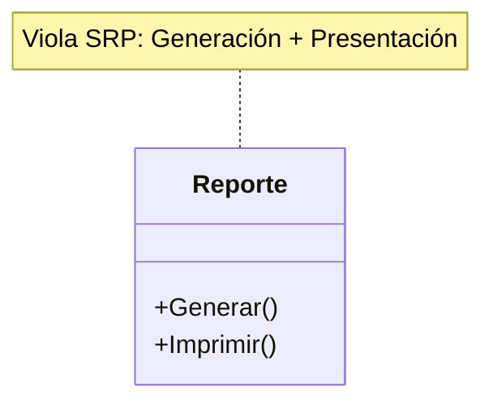

> Aquí, la clase `Reporte` genera e imprime el reporte – **dos responsabilidades**.

**Ejemplo BIEN diseñado (aplicando SRP):**

```csharp
public class Reporte
{
    public void Generar()
    {
        Console.WriteLine("Reporte generado");
    }
}

public class Impresora
{
    public void Imprimir(Reporte reporte)
    {
        Console.WriteLine("Imprimiendo reporte...");
    }
}
```

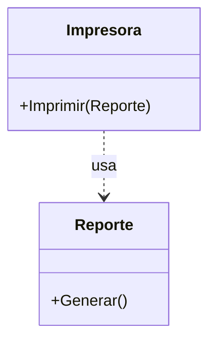

> Ahora cada clase tiene UNA responsabilidad. `Reporte` solo genera, `Impresora` solo imprime.

### O - Open/Closed Principle (Abierto/Cerrado)

**Teoría:**
Las entidades (clases, módulos, funciones) deben estar **abiertas para extensión** pero **cerradas para modificación**. Cuando añades nuevos comportamientos, lo haces **extendiendo** (heredando, agregando), no cambiando el código existente.

**Ejemplo MAL diseñado:**

```csharp
public class CalculadoraDeAreas
{
    public double AreaTotal(object[] figuras)
    {
        double area = 0;
        foreach (var figura in figuras)
        {
            if (figura is Circulo c)
                area += Math.PI * c.Radio * c.Radio;
            else if (figura is Cuadrado cu)
                area += cu.Lado * cu.Lado;
        }
        return area;
    }
}
```

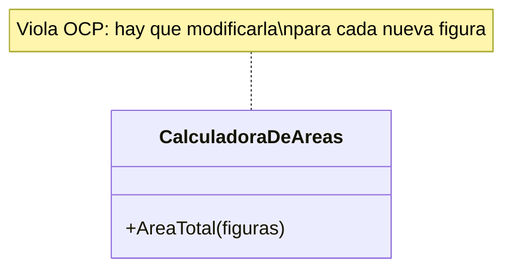

> Cada vez que se añade una nueva figura, hay que modificar el método: **violación OCP**.

**Ejemplo BIEN diseñado:**

```csharp
public abstract class Forma
{
    public abstract double Area();
}

public class Circulo : Forma
{
    public double Radio { get; set; }
    public override double Area()
    {
        double a = Math.PI * Radio * Radio;
        Console.WriteLine($"Área círculo: {a}");
        return a;
    }
}

public class Cuadrado : Forma
{
    public double Lado { get; set; }
    public override double Area()
    {
        double a = Lado * Lado;
        Console.WriteLine($"Área cuadrado: {a}");
        return a;
    }
}

// Uso
Forma[] formas = { new Circulo { Radio = 2 }, new Cuadrado { Lado = 3 } };
double areaTotal = formas.Sum(f => f.Area());
Console.WriteLine($"Área total: {areaTotal}");

```

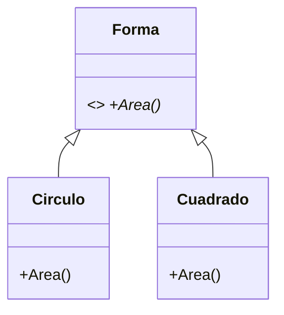

> Ahora puedes añadir nuevas figuras **sin modificar** la clase de cálculo. Esta está **abierta para extensión** pero **cerrada para modificación**.

### L - Liskov Substitution Principle (Sustitución de Liskov)

**Teoría:**
Si una clase B es una subclase de A, entonces deberías poder sustituir A por B **sin alterar el funcionamiento** del programa.
Nunca crees una subclase que **rompa las expectativas** del comportamiento de la clase base. Si no puedes garantizar esto, probablemente la herencia no es adecuada o el diseño debe ser revisado.

**Ejemplo que VIOLA Liskov:**

```csharp
public class Pajaro
{
    public virtual void Volar()
    {
        Console.WriteLine("El pájaro vuela");
    }
}

public class Pinguino : Pajaro
{
    public override void Volar()
    {
        throw new NotSupportedException("El pingüino no vuela");
    }
}

// Uso, Es decir, Se debería sustituir Pajaro por Pinguino, pero no funciona no cumple Liskov
Pajaro p = new Pinguino();
try
{
    p.Volar(); // Excepción inesperada
}
catch (Exception ex)
{
    Console.WriteLine($"Error: {ex.Message}");
}
```

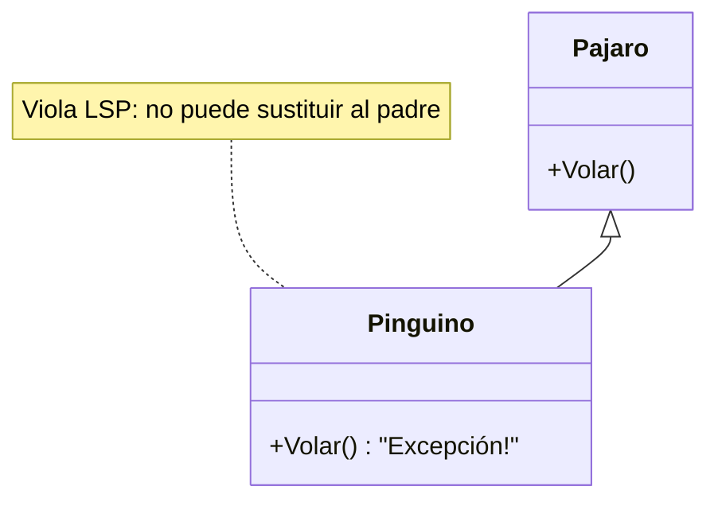

> ¡Un Pinguino no se puede comportar como un Pajaro!
> Hay que replantear el diseño, quizás con interfaces que separen capacidades.

**Solución con interfaces (aplicando Liskov):**

```csharp
public interface IPajaro { }
public interface IPajaroVolador : IPajaro
{
    void Volar();
}

public class Aguila : IPajaroVolador
{
    public void Volar() => Console.WriteLine("El águila vuela");
}

public class Pinguino : IPajaro
{
    public void Nadar() => Console.WriteLine("El pingüino nada");
}

// Ahora verás que no hay violación de Liskov
IPajaroVolador pajaroVolador = new Aguila();
pajaroVolador.Volar(); // Funciona perfectamente, donde se espera un IPajaroVolador se usa un Aguila y no hay violación.

```

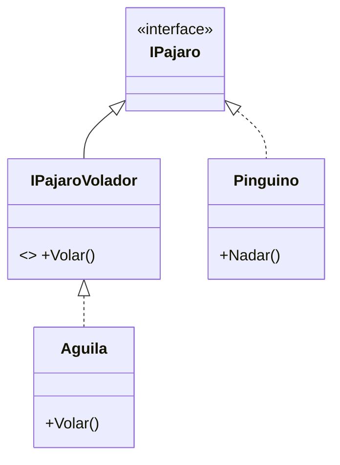

### I - Interface Segregation Principle (Segregación de Interfaces)

**Teoría:**
Ninguna clase debe verse obligada a implementar métodos que no necesita. Es mejor usar **interfaces pequeñas y especializadas** que una grande y generalista.

**MAL diseño (violando ISP):**

```csharp
public interface IMultifuncion
{
    void Imprimir();
    void Escanear();
}

public class ImpresoraSimple : IMultifuncion
{
    public void Imprimir() => Console.WriteLine("Imprimiendo");
    public void Escanear()
    {
        throw new NotSupportedException("No puede escanear");
    }
}
```

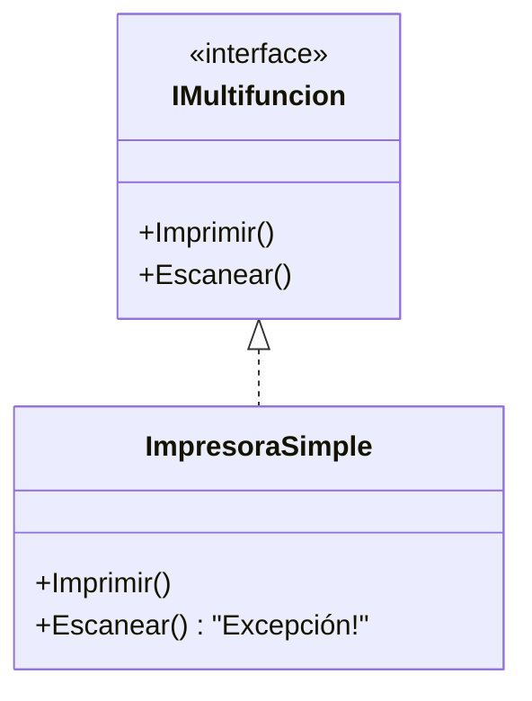

**BIEN diseñado (aplicando ISP):**

```csharp
public interface IImpresora
{
    void Imprimir();
}
public interface IEscaner
{
    void Escanear();
}

public class Impresora : IImpresora
{
    public void Imprimir() => Console.WriteLine("Imprimiendo documento");
}
public class Multifuncion : IImpresora, IEscaner
{
    public void Imprimir() => Console.WriteLine("Imprimiendo");
    public void Escanear() => Console.WriteLine("Escaneando");
}

var impresora = new Impresora();
impresora.Imprimir(); // "Imprimiendo documento"
var multifuncion = new Multifuncion();
multifuncion.Imprimir(); // "Imprimiendo"
multifuncion.Escanear(); // "Escaneando"

```

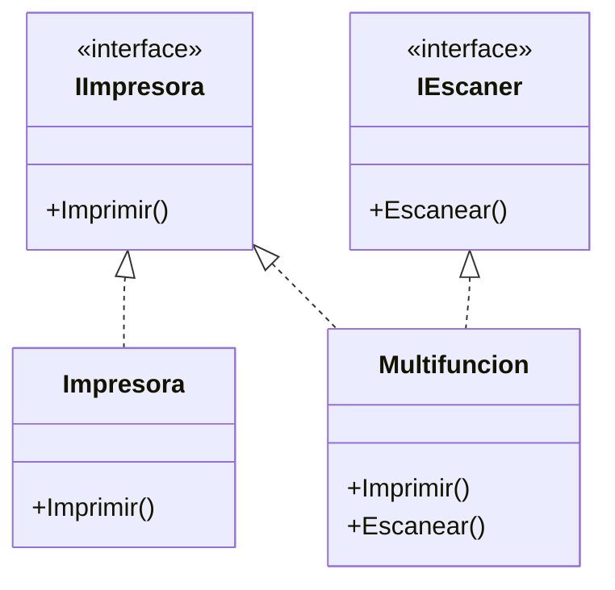

> Ahora cada clase implementa **únicamente** lo que necesita.

### D - Dependency Inversion Principle (Inversión de dependencias)

**Teoría:**
Las clases **no deben depender de implementaciones concretas**, sino de abstracciones (interfaces). Esto permite **facilitar cambios, testear y desacoplar** el sistema.

**MAL diseño (violación DIP):**

```csharp
public class MotorGasolina
{
    public void Encender() => Console.WriteLine("Motor gasolina encendido");
}
public class Automovil
{
    private MotorGasolina motor = new MotorGasolina(); // Acoplamiento fuerte, porque se hace dentro y no puedes cambiatr el tipo!!!
    public void Arrancar() => motor.Encender();
}
```

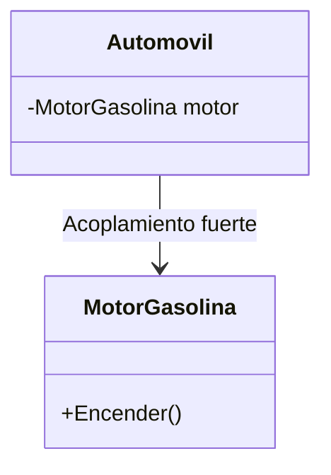

> No puedes cambiar el tipo de motor sin modificar el código de `Automovil`. Usa interfaces para desacoplar y por cumplir DIP (Dependency Inversion Principle por construcción).

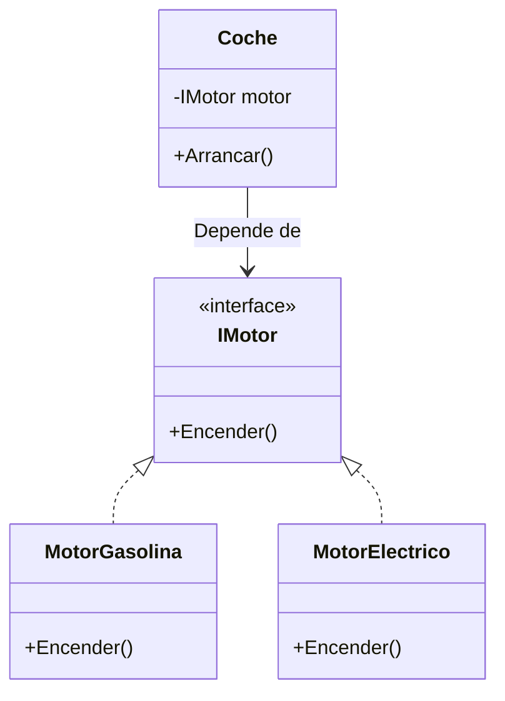

**BIEN diseñado (aplicando DIP):**

```csharp
public interface IMotor
{
    void Encender();
}
public class MotorGasolina : IMotor
{
    public void Encender() => Console.WriteLine("Motor gasolina encendido");
}
public class MotorElectrico : IMotor
{
    public void Encender() => Console.WriteLine("Motor eléctrico encendido");
}
public class Automovil
{
    private IMotor motor;
    public Automovil(IMotor motor)
    {
        this.motor = motor;
    }
    public void Arrancar() => motor.Encender();
}
// Uso:
Automovil auto1 = new Automovil(new MotorGasolina());
Automovil auto2 = new Automovil(new MotorElectrico());
auto1.Arrancar(); // Motor gasolina encendido
auto2.Arrancar(); // Motor eléctrico encendido
```
> Ahora puedes cambiar la dependencia **sin tocar ni una línea** en la clase `Automovil`. Inyectas la dependencia por el constructor y además usas una interface para desacoplar y polimorfismo. Aplicas inyección de dependencias.

### Resumen y guía didáctica

**Aplicar SOLID en tu diseño OO te permite:**
- Escribir código mantanible y flexible.
- Facilitar la prueba unitaria y la evolución.
- Desacoplar módulos y funciones, facilitando la extensión futura.
- Evitar anti-patrones como el God Object, la jerarquía profunda, la rigidez o la duplicación de lógica.

**Recuerda:**
- **SRP**: Una clase = Una responsabilidad.
- **OCP**: El código se extiende, NO se modifica.
- **LSP**: Los subtipos se pueden usar donde se espera la clase base.
- **ISP**: Interfaces pequeñas y funcionales.
- **DIP**: Depender siempre de abstracciones (interfaces).


### Ejemplo completo aplicando SOLID

```csharp
public interface INotificador
{
    void Notificar(string mensaje);
}

public class EmailNotificador : INotificador
{
    public void Notificar(string mensaje)
    {
        Console.WriteLine($"Enviando email: {mensaje}");
    }
}

public class SMSNotificador : INotificador
{
    public void Notificar(string mensaje)
    {
        Console.WriteLine($"Enviando SMS: {mensaje}");
    }
}

public class Usuario
{
    private readonly INotificador notificador;

    public Usuario(INotificador notificador)
    {
        this.notificador = notificador;
    }

    public void Registrar(string nombre)
    {
        // Lógica de registro...
        notificador.Notificar($"Usuario {nombre} registrado exitosamente.");
    }
}

public class UsuarioConModificacionDeNotificador
{
    private INotificador notificador;

    public UsuarioConModificacionDeNotificador(INotificador notificador)
    {
        this.notificador = notificador;
    }

    public void CambiarNotificador(INotificador nuevoNotificador)
    {
        this.notificador = nuevoNotificador;
    }

    public void Registrar(string nombre)
    {
        // Lógica de registro...
        notificador.Notificar($"Usuario {nombre} registrado exitosamente.");
    }
}

// Uso
INotificador emailNotificador = new EmailNotificador();
Usuario usuario = new Usuario(emailNotificador);
usuario.Registrar("Juan Pérez");

UserioConModificacionDeNotificador usuario2 = new UsuarioConModificacionDeNotificador(emailNotificador);
usuario2.Registrar("Ana Gómez");
usuario2.CambiarNotificador(new SMSNotificador());
usuario2.Registrar("Ana Gómez");

```

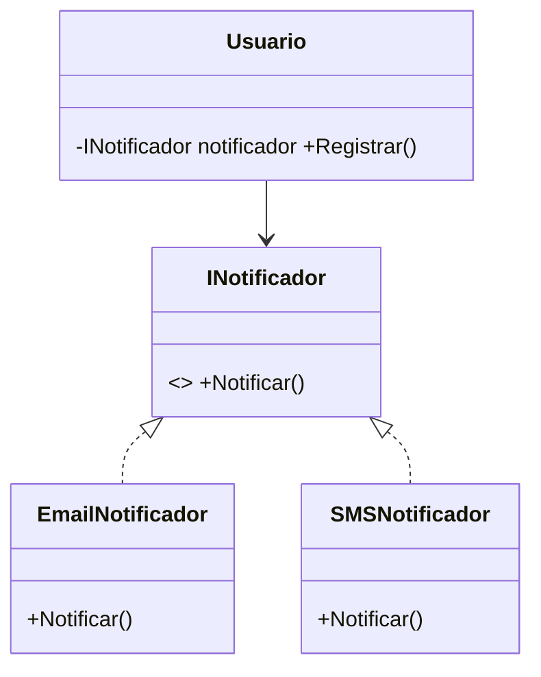

Analisis de los principios SOLID aplicados:
- **SRP**: `Usuario` solo se encarga de la lógica de registro, `EmailNotificador` y `SMSNotificador` solo de notificar. Cada clase tiene una única responsabilidad.
- **OCP**: Puedes añadir nuevos tipos de notificadores sin modificar `Usuario`. Esto cumple el principio abierto/cerrado ya que `Usuario` está cerrado para modificaciones pero abierto para extensiones.
- - **LSP**: Cualquier implementación de `INotificador` puede ser usada en lugar de otra sin alterar el comportamiento esperado de `Usuario`. Esto cumple el principio de sustitución de Liskov y asegura que las clases derivadas pueden sustituir a la base sin problemas.
- **ISP**: `INotificador` es una interfaz pequeña y específica. Las clases que la implementan no están obligadas a implementar métodos que no necesitan. Se puede tener múltiples interfaces si es necesario.
- **DIP**: `Usuario` depende de la abstracción `INotificador`, no de implementaciones concretas. Esto permite cambiar el tipo de notificador sin modificar `Usuario`. De hecho puedes inyectar cualquier implementación de `INotificador`, ver el caso de `UsuarioConModificacionDeNotificador` que permite cambiar el notificador en tiempo de ejecución.


**En conclusión, dominar SOLID es el primer paso hacia el diseño profesional de aplicaciones orientadas a objetos.**

> 📝 **Truco del Examinador:** Pregunta típica: "¿Qué principio SOLID es más importante?"
> **Respuesta:** Todos son importantes, pero **DIP (Inversión de Dependencia)** es el más transformador. Si aplicas DIP correctamente, los demás principios suelen seguir naturalmente.

```csharp
// EJEMPLO COMPLETO: Sistema de notificaciones con TODOS los principios SOLID
// Aplica: SRP, OCP, LSP, ISP, DIP

// 1. INTERFACES PEQUEÑAS (ISP - Interface Segregation)
public interface IEnviable { void Enviar(string destinatario, string mensaje); }
public interface IRegistrable { void Registrar(string nombre); }

// 2. CONTRATOS ABIERTOS A EXTENSIÓN (OCP - Open/Closed)
public interface INotificador
{
    void Notificar(string mensaje);
}

// 3. RESPONSABILIDAD ÚNICA (SRP - Single Responsibility)
public class EmailService : IEnviable
{
    public void Enviar(string destinatario, string mensaje) => 
        Console.WriteLine($"EMAIL a {destinatario}: {mensaje}");
}

public class SMSService : IEnviable
{
    public void Enviar(string destinatario, string mensaje) => 
        Console.WriteLine($"SMS a {destinatario}: {mensaje}");
}

// 4. INVERSIÓN DE DEPENDENCIA (DIP - Dependency Inversion)
// Dependemos de abstracciones (IEnviable), no de concreciones
public class NotificadorEmail : INotificador
{
    private readonly IEnviable _emailService;
    
    public NotificadorEmail(IEnviable emailService)  // Inyección
    {
        _emailService = emailService;
    }
    
    public void Notificar(string mensaje) => 
        _emailService.Enviar("cliente@email.com", mensaje);
}

// 5. SUSTITUIBLE (LSP - Liskov Substitution)
// Cualquier IEnviable puede sustituirse
public class Usuario
{
    private readonly INotificador _notificador;
    
    public Usuario(INotificador notificador)  // Acepta CUALQUIER notificador
    {
        _notificador = notificador;
    }
    
    public void Registrar(string nombre)
    {
        Console.WriteLine($"Registrando usuario: {nombre}");
        _notificador.Notificar($"Usuario {nombre} registrado");
    }
}

// USO: (Flexible) - Puedo cambiar componentes sin modificar Usuario
var emailService = new EmailService();
var notificador = new NotificadorEmail(emailService);
var usuario = new Usuario(notificador);

 usuario.Registrar("Ana");
// Registrando usuario: Ana
// EMAIL a cliente@email.com: Usuario Ana registrado
```

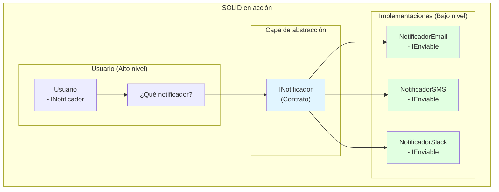

> 💡 **Regla nemotécnica SOLID:**
> - **S** = **S**olo una cosa (cada clase)
> - **O** = **O**tra cosa nueva = **O**tra clase (extiende, no modifiques)
> - **L** = **L**as subclases en lugar de la clase base (sustitución)
> - **I** = **I**nterfaces pequeñas (no gordas)
> - **D** = **D**epende de abstracciones (no de clases concretas)

> 📝 **Nota del Profesor:** "La diferencia entre un programador junior y uno senior no es saber escribir código, sino saber estructurarlo. SOLID te da las reglas; la experiencia te dice cuándo romperlas."

---

## 6.3. Caso Práctico Web: Patrón Repositorio y SOLID

Para que veas que esto no es solo teoría de "Animales y Perros", vamos a ver cómo se aplica **Interfaces**, **DIP** (Inversión de Dependencia) y **Polimorfismo** en una aplicación Web real. Este es el estándar de la industria.

### El Problema
Queremos guardar usuarios. A veces en una base de datos SQL, pero para hacer pruebas (testing) queremos guardarlos en memoria (una lista falsa). Si escribimos el código directamente contra SQL, no podremos testearlo fácilmente.

### La Solución: El Patrón Repositorio

1.  **Abstracción (Interface):** Definimos el contrato.
2.  **Concreción (Implementaciones):** SQL y Memoria.
3.  **Consumo (Controlador):** Pide la interfaz, no la clase.

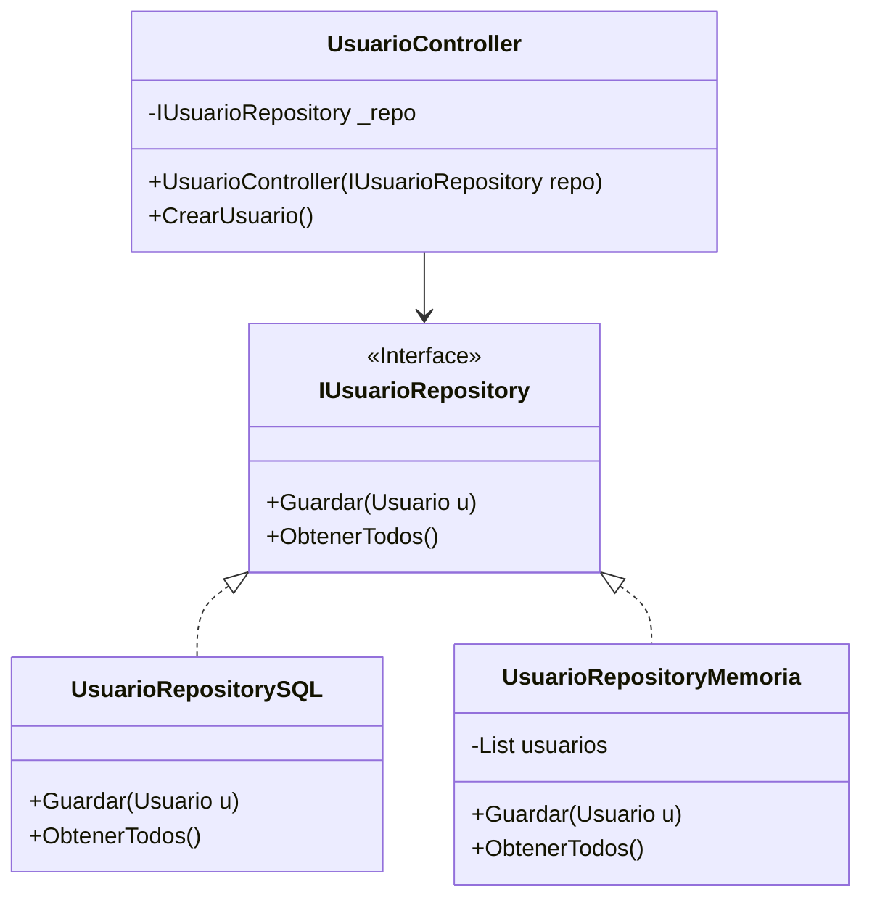

### Código Real

```csharp
// 1. La Interfaz (El Contrato)
public interface IUsuarioRepository
{
    void Guardar(Usuario u);
    List<Usuario> ObtenerTodos();
}

// 2. Implementación Real (SQL)
public class UsuarioRepositorySQL : IUsuarioRepository
{
    public void Guardar(Usuario u)
    {
        Console.WriteLine($"Guardando usuario {u.Nombre} en SQL Server...");
        // Lógica real de ADO.NET o Entity Framework
    }
    public List<Usuario> ObtenerTodos() => new List<Usuario>(); // Simulado
}

// 3. Implementación de Mentira (Mock para Tests)
public class UsuarioRepositoryMemoria : IUsuarioRepository
{
    private List<Usuario> _fakeDb = new List<Usuario>();

    public void Guardar(Usuario u)
    {
        Console.WriteLine($"Guardando usuario {u.Nombre} en Lista en Memoria.");
        _fakeDb.Add(u);
    }
    public List<Usuario> ObtenerTodos() => _fakeDb;
}

// 4. El Consumidor (Controlador o Servicio)
// Fíjate que en el constructor pedimos la INTERFAZ, no la clase.
// Esto es Inyección de Dependencias (DIP).
public class UsuarioController
{
    private readonly IUsuarioRepository _repositorio;

    public UsuarioController(IUsuarioRepository repositorio)
    {
        _repositorio = repositorio;
    }

    public void RegistrarNuevoUsuario(string nombre)
    {
        var nuevoUsuario = new Usuario { Nombre = nombre };
        _repositorio.Guardar(nuevoUsuario); // Polimorfismo: no sabe si es SQL o Memoria
    }
}

// 5. Configuración (Simulando el Program.cs de una API)
// Aquí decidimos qué implementación usar para TODA la app.

// Entorno de Producción:
IUsuarioRepository repoProduccion = new UsuarioRepositorySQL();
UsuarioController controllerProd = new UsuarioController(repoProduccion);
controllerProd.RegistrarNuevoUsuario("Cliente Real");
// Salida: Guardando ... en SQL Server...

// Entorno de Tests:
IUsuarioRepository repoTest = new UsuarioRepositoryMemoria();
UsuarioController controllerTest = new UsuarioController(repoTest);
controllerTest.RegistrarNuevoUsuario("Usuario de Prueba");
// Salida: Guardando ... en Lista en Memoria.
```

**Conclusión Docente:** Este es el motivo real por el que estudiamos interfaces. No es para dibujar figuras geométricas, es para poder cambiar la base de datos de tu aplicación sin tener que reescribir todo el código de tu controlador. Eso es **desacoplamiento**.
