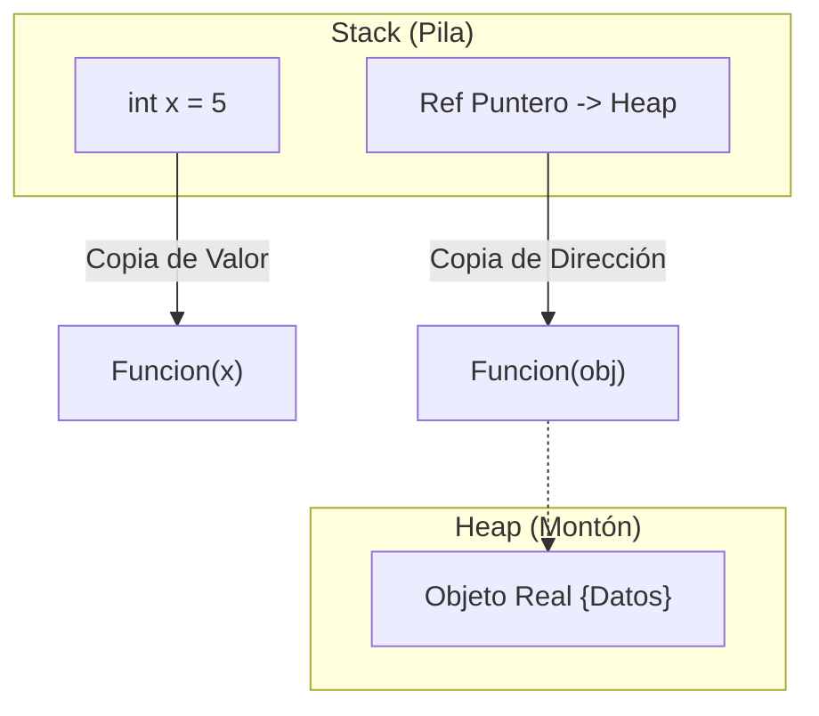

- [7. Otros aspectos de C#](#7-otros-aspectos-de-c)
  - [7.1. Referencias y paso de parámetros (`ref` vs `out` vs `in`)](#71-referencias-y-paso-de-parámetros-ref-vs-out-vs-in)
    - [Comportamiento sin modificadores (Paso por valor)](#comportamiento-sin-modificadores-paso-por-valor)
    - [El modificador `ref` (Entrada y Salida)](#el-modificador-ref-entrada-y-salida)
      - [Ejemplo: Array con y sin `ref`](#ejemplo-array-con-y-sin-ref)
    - [El modificador `out` (Salida Pura)](#el-modificador-out-salida-pura)
    - [El modificador `in` (Solo Lectura / Rendimiento)](#el-modificador-in-solo-lectura--rendimiento)
    - [Resumen y Buenas Prácticas: La Tabla Definitiva](#resumen-y-buenas-prácticas-la-tabla-definitiva)
      - [Tabla de Comportamiento y Permisos](#tabla-de-comportamiento-y-permisos)
      - [Guía de decisión rápida (Buenas Prácticas)](#guía-de-decisión-rápida-buenas-prácticas)
    - [Ejemplos Completos de Código](#ejemplos-completos-de-código)
      - [Caso 1: Optimización de Structs con `in`](#caso-1-optimización-de-structs-con-in)
      - [Caso 2: Clases - La trampa del `new` (Ref vs Normal)](#caso-2-clases---la-trampa-del-new-ref-vs-normal)
      - [Caso 3: Arrays y `out` (La fábrica de datos)](#caso-3-arrays-y-out-la-fábrica-de-datos)
  - [7.2. Mejorando la Configuración de nuestros Proyectos](#72-mejorando-la-configuración-de-nuestros-proyectos)
    - [Recomendaciones Clave](#recomendaciones-clave)
    - [Ejemplo de .csproj Robusto](#ejemplo-de-csproj-robusto)


# 7. Otros aspectos de C#

C# es un lenguaje moderno y potente. En esta sección final exploraremos características avanzadas como el paso de parámetros por referencia y cómo configurar nuestros proyectos para la máxima calidad.

---

## 7.1. Referencias y paso de parámetros (`ref` vs `out` vs `in`)

Antes de terminar, es importante entender cómo se pasan los parámetros en C# y cuando usamos referencias o valores: clases, estructuras, tipos primitivos o arrays.

Debemos recordar que en C# los tipos se dividen en dos grandes categorías:
- **Tipos por valor**: incluyen tipos primitivos (int, float, bool, etc.) y estructuras (struct). Estos tipos almacenan directamente sus datos y cuando se pasan como parámetros a métodos, se pasa una copia del valor. Se almacenan en la pila (stack).
- **Tipos por referencia**: incluyen clases (class), arrays y cadenas (string). Estos tipos almacenan una referencia (dirección de memoria) al objeto real. Cuando se pasan como parámetros, se pasa una copia de la referencia, no del objeto en sí. Se almacenan en el montón (heap).



### Comportamiento sin modificadores (Paso por valor)

Es lo que ocurre cuando declaramos una función normal: `void MiFuncion(int numero, int[] array)`.

* **Con Structs y tipos de datos simples (`int`, `bool`):** Se crea una **COPIA** independiente, no relacionada.
* *Efecto:* Si cambias el valor dentro, fuera **no pasa nada**. Es decir, es como hacer una fotocopia del papel y trabajar sobre ella, por mucho que la modifiques, el original sigue igual.

```csharp
void ModificarValor(int numero) {
    numero = 99; // Cambio local, no afecta fuera
}

int x = 5;
ModificarValor(x);
Console.WriteLine(x); // Imprime 5, no 99
```

* **Con Clases y Arrays:** Se pasa una **COPIA DE LA DIRECCIÓN**.
* *Efecto A:* Puedes entrar a la casa y cambiar los muebles (modificar `array[0]` o `objeto.Propiedad`). **Esto SÍ afecta fuera.**
  
```csharp
void ModificarArray(int[] numeros) {
    numeros[0] = 99; // Cambia el contenido del array original
}

int[] arr = { 1, 2, 3 };
ModificarArray(arr);
Console.WriteLine(arr[0]); // Imprime 99
```

* *Efecto B:* NO puedes cambiar la casa por otra (hacer `new`). Si haces `new`, solo cambias tu copia local de la dirección. **Esto NO afecta fuera.**

```csharp
void ReasignarArray(int[] numeros) {
    numeros = new int[5]; // Cambia la referencia local, no afecta fuera, No se ve fuera
}

int[] arr = { 1, 2, 3 };
ReasignarArray(arr);
Console.WriteLine(arr.Length); // Imprime 3, no 5
```

### El modificador `ref` (Entrada y Salida)

Usamos `ref` cuando queremos romper las reglas anteriores y conectar la variable de dentro con la de fuera permanentemente.

| Tipo de Dato              | ¿Qué permite `ref`?                                          | Ejemplo Mental                                                                                |
| ------------------------- | ------------------------------------------------------------ | --------------------------------------------------------------------------------------------- |
| **Structs y tipos de datos simples** (int, bool...) | Permite modificar el valor original. Sin `ref` no se podría. | "Te doy acceso a mi hoja de papel original para que borres y escribas."                       |
| **Clase / Array**         | Permite hacer un **`new`** (reasignar) y que afecte fuera.   | "Te doy las llaves de mi casa y permiso para que **mudemos a mi familia a otra casa nueva**." |

#### Ejemplo: Array con y sin `ref`

```csharp
// 1. SIN ref: Puedo cambiar datos, pero NO reasignar
void ModificarVariables(int numero) {
    numero = 50;           // ❌ NO se ve fuera (copia local)
}

void ModificarDatos(int[] numeros) {
    numeros[0] = 99;       // ✅ Se ve fuera (cambio mueble)
    numeros = new int[5];  // ❌ NO se ve fuera (cambio casa localmente)
}

// 2. CON ref: Puedo cambiar datos Y reasignar
void ModificarVariablesRef(ref int numero) {
    numero = 50;           // ✅ Se ve fuera (modifica original)
}

void ReasignarArray(ref int[] numeros) {
    numeros = new int[] { 100, 200 }; // ✅ El array original de fuera AHORA ES ESTE
}


var arr = new int[] { 1, 2, 3 };
ModificarDatos(arr);
Console.WriteLine(arr[0]); // Imprime 99 (cambio mueble sí se ve)
Console.WriteLine(arr.Length); // Imprime 3 (cambio casa no se ve)
int val = 10;
ModificarVariables(val);
Console.WriteLine(val); // Imprime 10 (no se ve el cambio)

ReasignarArray(ref arr););
Console.WriteLine(arr.Length); // Imprime 2 (cambio casa sí se ve)
ModificarVariablesRef(ref val);
Console.WriteLine(val); // Imprime 50 (cambio sí se ve)
```

### El modificador `out` (Salida Pura)

Funciona técnicamente igual que `ref`, pero con una **obligación de seguridad**: la función **debe** crear el dato. No sirve de nada que ya tenga valores, estás **obligado** a asignarlo dentro por todos "los caminos" posibles.

* **Structs o tipos de datos simples:** Se usa para devolver valores calculados (ej. `TryParse`).
* **Clases/Arrays:** Se usa para que la función sea una "fábrica" que cree el objeto por ti.

> **Diferencia Clave con `ref`:** En `ref`, el objeto ya existe antes de entrar. En `out`, el objeto se "fabrica" dentro.

```csharp
// Ejemplo con Struct / Tipo simple
void ObtenerValor(out int numero, out bool exito) {
    var res = new Random().Next(0, 2);
    if (res == 1) {
        numero = 42;
        exito = true;
    } else {
        numero = 0;
        exito = false;
    }
}

// Da igual el valor que se les asignen porque se van a sobrescribir
int valor;
bool resultado;
ObtenerValor(out valor, out resultado);
Console.WriteLine($"Valor: {valor}, Éxito: {resultado}"); // Imprime Valor: 42, Éxito: True o Valor: 0, Éxito: False
```

### El modificador `in` (Solo Lectura / Rendimiento)

Con `in` indicamos que el parámetro se pasa por referencia (no se copia) pero **no se puede modificar** dentro de la función. Es una forma de optimizar el rendimiento cuando pasamos estructuras o arrays grandes sin permitir cambios accidentales. Es decir, **es una referencia "de solo lectura"**.

¿Por qué usamos `in` por ejemplo en Structs grandes? Porque copiar estructuras grandes (en el paso por valor, que es el paso por defecto) puede ser costoso en rendimiento. Al usar `in`, evitamos la copia (hacemos un paso por referencia) y mejoramos la eficiencia, pero garantizamos que el dato original no se modificará (está bloqueado).

| Tipo de Dato      | Objetivo Principal                           | Comportamiento                                                                     |
| ----------------- | -------------------------------------------- | ---------------------------------------------------------------------------------- |
| **Struct**        | **Rendimiento.** Evita copiar datos grandes. | Pasa la referencia pero **bloquea** cualquier modificación. Es un "candado total". |
| **Clase / Array** | **Seguridad (Intención).**                   | Impide hacer `new` (reasignar). <br>                                               |

<br>⚠️ **¡OJO!** No impide modificar los datos internos (`array[0] = 5` sigue funcionando). |

> **Nota para expertos:** En una Clase o Array, `in` solo protege la variable (la flecha), no el contenido del objeto. En un Struct, protege todo.

```csharp
struct Punto { public int X, Y; }
class Circulo { public Punto Centro; public double Radio; }

void MoverPunto(in Punto p) {
    // p.X = 10; // ❌ ERROR DE COMPILACIÓN: No se puede modificar un struct 'in'
    Console.WriteLine($"Punto en ({p.X}, {p.Y})");
}

void ReasignarCirculo(in Circulo c) {
    // c = new Circulo(); // ❌ ERROR DE COMPILACIÓN: No se puede reasignar un 'in'
    c.Centro.X = 10; // ✅ Esto SÍ se permite, porque modificamos el contenido, no la referencia
}

Punto pt = new Punto { X = 1, Y = 2 };
MoverPunto(in pt); // Imprime Punto en (1, 2)
Circulo cir = new Circulo { Centro = new Punto { X = 0, Y = 0 }, Radio = 5 };
ReasignarCirculo(in cir);
Console.WriteLine($"Centro del círculo: ({cir.Centro.X}, {cir.Centro.Y})"); // Imprime Centro del círculo: (10, 0)
```

### Resumen y Buenas Prácticas: La Tabla Definitiva

Para no equivocarnos nunca, debemos hacernos dos preguntas antes de elegir un modificador:

1. **¿Qué tipo de dato estoy pasando?** (¿Es un struct/int/bool o es una clase/array?)
2. **¿Qué quiero hacer con él?** (¿Solo leer, modificar sus datos internos o reinicializarlo con un `new`?)

#### Tabla de Comportamiento y Permisos

| Tipo de Dato      | Modificador | ¿Copia al pasar? | ¿Cambia datos internos? | ¿Permite `new`?      | Uso recomendado                   |
| ----------------- | ----------- | ---------------- | ----------------------- | -------------------- | --------------------------------- |
| **Struct / Int**  | (Ninguno)   | **SÍ**           | Solo local              | No afecta fuera      | Valores simples (int, bool).      |
| **Struct / Int**  | **ref**     | No               | **SÍ** (Original)       | **SÍ** (Original)    | Swaps o contadores.               |
| **Struct / Int**  | **in**      | No               | **NO** (Error)          | **NO** (Error)       | Optimizar structs grandes.        |
|                   |             |                  |                         |                      |                                   |
| **Clase / Array** | (Ninguno)   | No (Copia ref)   | **SÍ** (Original)       | No afecta fuera      | **Uso estándar (90%)**.           |
| **Clase / Array** | **ref**     | No               | **SÍ** (Original)       | **SÍ** (Original)    | Para redimensionar o `new`.       |
| **Clase / Array** | **out**     | No               | **SÍ**                  | **SÍ** (Obligatorio) | Fábricas/Creación de objetos.     |
| **Clase / Array** | **in**      | No               | **SÍ** (¡Cuidado!)      | **NO** (Error)       | Marcar intención de no reasignar. |

#### Guía de decisión rápida (Buenas Prácticas)

Para saber qué usar, sigue este orden lógico:

1. **Por defecto, no uses nada.** C# ya gestiona las clases y arrays por referencia de forma eficiente. Solo usa modificadores si tienes un motivo concreto.
2. **Usa `out`** solo cuando necesites que una función devuelva más de un resultado (ej. el resultado de una operación y un mensaje de error).
3. **Usa `ref`** en dos casos muy específicos:
* Si quieres que un `int`, `bool` o `struct` cambie su valor real fuera.
* Si quieres que un objeto o array sea **reemplazado por uno nuevo** (`new`) y que fuera se enteren.
4. **Usa `in`** principalmente para **rendimiento en structs**. Si tienes una estructura con muchos campos que pasas miles de veces por segundo, `in` evitará que el procesador pierda tiempo haciendo copias. En clases, su beneficio es meramente informativo para decir "no voy a reasignar esta variable".

### Ejemplos Completos de Código

A continuación, analizamos tres escenarios clave donde la elección del modificador cambia totalmente el resultado.

#### Caso 1: Optimización de Structs con `in`

Aquí el objetivo es **rendimiento**. Al usar `in`, evitamos copiar los datos, pero a cambio perdemos la capacidad de escribir.

```csharp
struct CoordenadaGPS 
{ 
    public double Latitud, Longitud, Altitud; 
    // Imagina que aquí hay muchos más datos...
}

// ✅ CORRECTO: Usamos 'in' para leer rápido sin copiar
void CalcularDistancia(in CoordenadaGPS p) 
{
    // Podemos leer
    Console.WriteLine($"Lat: {p.Latitud}"); 

    // p.Latitud = 40.0; // ❌ ERROR: 'in' pone un candado a toda la estructura.
}

```

#### Caso 2: Clases - La trampa del `new` (Ref vs Normal)

Este es el error más común. Recordad la analogía: *Sin ref puedo cambiar los muebles de la casa, pero no puedo mudarme a otra casa.*

```csharp
class Alumno { public string Nombre; }

// ❌ INTENTO FALLIDO (Paso por valor de referencia)
void IntentarCrearAlumno(Alumno a) 
{
    a.Nombre = "Ana";       // ✅ Esto SÍ cambia el nombre del objeto original
    a = new Alumno();       // ❌ Esto crea un alumno nuevo SOLO dentro de la función
    a.Nombre = "Pedro";     // ❌ Modificamos el nuevo alumno, el original sigue siendo "Ana"
}

// ✅ FORMA CORRECTA (Uso de ref)
void CrearAlumnoReal(ref Alumno a) 
{
    a = new Alumno();       // ✅ Al usar ref, la variable de fuera apunta a este nuevo objeto
    a.Nombre = "Maria";     // ✅ El cambio persiste
}

// Uso:
Alumno miAlumno = new Alumno { Nombre = "Juan" };

IntentarCrearAlumno(miAlumno);
Console.WriteLine(miAlumno.Nombre); // Imprime "Ana" (El new se perdió, pero el cambio de nombre no)

CrearAlumnoReal(ref miAlumno);
Console.WriteLine(miAlumno.Nombre); // Imprime "Maria" (El objeto ha sido sustituido)

```

#### Caso 3: Arrays y `out` (La fábrica de datos)

Usamos `out` cuando la función es la encargada de **crear** el array desde cero.

```csharp
// Función que "fabrica" un array de números pares
void GenerarPares(int cantidad, out int[] lista) 
{
    // Con 'out', C# nos OBLIGA a asignar la variable antes de salir
    // No importa si 'lista' tenía datos antes, aquí nace de nuevo.
    lista = new int[cantidad];
    
    for (int i = 0; i < cantidad; i++) 
    {
        lista[i] = i * 2;
    }
}

// Uso:
int[] misNumeros; // No hace falta ni inicializarlo con = null
GenerarPares(5, out misNumeros);
// misNumeros ahora es { 0, 2, 4, 6, 8 }

```

---

## 7.2. Mejorando la Configuración de nuestros Proyectos

Para mejorar la configuración de nuestros proyectos en C#, podemos ajustar varias opciones en el archivo de proyecto (.csproj) o mediante la interfaz de Visual Studio.

### Recomendaciones Clave

1. **Establecer la versión de C#:** Asegúrate de que tu proyecto esté configurado para usar la versión más reciente de C# para aprovechar las últimas características del lenguaje.
2. **Habilitar análisis de código:** Activa las reglas de análisis de código para mantener un código limpio y consistente.
3. **Configurar advertencias como errores:** Esto ayuda a mantener un código de alta calidad al tratar las advertencias como errores durante la compilación.
4. **Optimizar para la publicación:** Configura las opciones de publicación para optimizar el rendimiento y reducir el tamaño del paquete.
5. **Importaciones implícitas:** Habilita las importaciones implícitas para reducir la cantidad de declaraciones `using` en tus archivos de código.
6. **Nullable Reference Types:** Habilita las referencias anulables para mejorar la seguridad del código y evitar errores de referencia nula.

### Ejemplo de .csproj Robusto

```xml
<Project Sdk="Microsoft.NET.Sdk">

  <PropertyGroup>
    <OutputType>Exe</OutputType>
    <TargetFramework>net10.0</TargetFramework>
    <LangVersion>latest</LangVersion> <!-- Usar la última versión de C# -->
    
    <!-- Seguridad ante Nulos: El compilador te avisa si algo puede ser null -->
    <Nullable>enable</Nullable> 
    
    <!-- Calidad de Código: Las advertencias rompen la build para obligarte a arreglarlas -->
    <TreatWarningsAsErrors>true</TreatWarningsAsErrors> 
    <AnalysisMode>AllEnabledByDefault</AnalysisMode> 
    
    <ImplicitUsings>enable</ImplicitUsings> <!-- Menos ruido de 'using System;' -->
    <Optimize>true</Optimize> <!-- Optimizar para publicación -->
  </PropertyGroup>

  <!-- ItemGroup nos permite definir elementos como referencias, liberias y usings 
    Puedes definir importaciones para todo el proyecto aquí
    -->
    <ItemGroup>
        <!-- Esto sería una importación global de un proyecto de servicios
        <Using Include="MyProject.Services" />-->
        <!-- Importación estática para usar miembros estáticos 
        de System.Console sin prefijo -->
        <Using Include="System.Console" Static="True"/>

        <!-- Librerías con nuget -->
        <PackageReference Include="Newtonsoft.Json" Version="13.0.3" />
    </ItemGroup>
</Project>
```