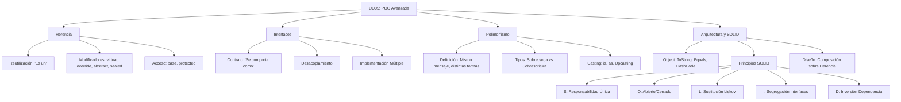

- [8. Resumen y Conclusiones](#8-resumen-y-conclusiones)
  - [8.1. Mapa Conceptual de la Unidad](#81-mapa-conceptual-de-la-unidad)
  - [8.2. Conceptos Clave Detallados](#82-conceptos-clave-detallados)
    - [Herencia ("Es un")](#herencia-es-un)
    - [Interfaces ("Puede hacer / Se comporta como")](#interfaces-puede-hacer--se-comporta-como)
    - [Polimorfismo (La Magia)](#polimorfismo-la-magia)
    - [La Clase Object](#la-clase-object)
  - [8.3. Arquitectura y Diseño (SOLID)](#83-arquitectura-y-diseño-solid)
  - [8.4. Otros Aspectos](#84-otros-aspectos)
  - [8.5. Checklist de Supervivencia](#85-checklist-de-supervivencia)

# 8. Resumen y Conclusiones

En esta unidad hemos profundizado en los pilares fundamentales de la Programación Orientada a Objetos moderna, pasando de crear clases aisladas a diseñar sistemas complejos de objetos que interactúan entre sí.

## 8.1. Mapa Conceptual de la Unidad

Este diagrama resume las relaciones entre los conceptos aprendidos:

## 8.2. Conceptos Clave Detallados

### Herencia ("Es un")
Es el mecanismo por el cual una clase (Hija) adquiere las propiedades y métodos de otra (Padre).
- **Objetivo:** Reutilizar código y crear jerarquías lógicas.
- **Limitación en C#:** Solo se puede heredar de **una** única clase (Herencia simple).
- **Constructores:** No se heredan, pero se invocan en cadena. Usamos `base(...)` para llamar al constructor del padre.
- **`protected`:** Nivel de acceso que permite visibilidad a las clases hijas pero mantiene la privacidad ante el mundo exterior.
- **`sealed`:** Impide que una clase tenga descendencia o que un método sea sobrescrito de nuevo.

### Interfaces ("Puede hacer / Se comporta como")
Definen un contrato que una clase debe cumplir (qué métodos debe tener), sin especificar cómo lo hace.
- **Objetivo:** Desacoplar el código y definir capacidades comunes entre objetos dispares.
- **Flexibilidad:** Una clase puede implementar **múltiples** interfaces.
- **Miembros:** Métodos, Propiedades, Indexadores y Eventos. Desde C# 8.0 pueden tener implementaciones por defecto.
- **Uso clave:** Son la base de la Inversión de Dependencias (la 'D' de SOLID). Programamos contra interfaces, no contra implementaciones concretas.

### Polimorfismo (La Magia)
Es la capacidad de un objeto de tomar muchas formas. Nos permite tratar a objetos de clases derivadas como si fueran de su clase base o interfaz.

1.  **Polimorfismo de Sobrecarga (Estático):** Mismo nombre de método, distintos parámetros. Se resuelve al compilar.
2.  **Polimorfismo de Sobrescritura (Dinámico):** El verdadero poder. Una variable de tipo `Animal` puede contener un `Perro` o un `Gato`. Al llamar a `animal.HacerSonido()`, se ejecuta la versión específica del objeto real (`Guau` o `Miau`) en tiempo de ejecución.
    *   **`virtual`:** El padre da permiso para modificar.
    *   **`abstract`:** El padre **obliga** a definir (no tiene cuerpo).
    *   **`override`:** El hijo toma el control y define su comportamiento.

### La Clase Object
Es la raíz de toda la jerarquía de tipos en .NET. Toda clase hereda implícitamente de ella.
- **`ToString()`:** Representación en cadena del objeto. Sobrescríbelo siempre para debug.
- **`Equals()`:** Comparación de contenido (identidad vs igualdad).
- **`GetHashCode()`:** Identificador numérico para tablas hash.

## 8.3. Arquitectura y Diseño (SOLID)
Escribir código que funcione es fácil; escribir código mantenible es el arte.
- **Composición vs Herencia:** Prefiere la composición ("Tiene un") sobre la herencia ("Es un") para evitar jerarquías rígidas y frágiles.
- **SOLID:**
    - **S:** Una clase, una razón para cambiar.
    - **O:** Extender funcionalidad sin tocar código antiguo.
    - **L:** Las clases hijas deben poder sustituir al padre sin romper nada.
    - **I:** Muchas interfaces pequeñas son mejor que una gigante.
    - **D:** Depende de abstracciones (interfaces), no de clases concretas.

## 8.4. Otros Aspectos
- **Casting Seguro:**
    - `is`: Comprueba si un objeto es de un tipo (devuelve true/false).
    - `as`: Intenta convertir. Si falla, devuelve `null` (no lanza excepción).
- **Tipos de Referencia vs Valor:** Entender que las clases se pasan por referencia y los structs por valor es vital para evitar bugs de estado compartido.
- **Paso de parámetros:** `ref`, `out`, `in` para controlar cómo viajan los datos entre métodos.

## 8.5. Checklist de Supervivencia
Antes de dar por cerrado el tema, asegúrate de poder responder **SÍ** a estas preguntas:

- [ ] ¿Entiendo la diferencia entre `override` y `new` (ocultación)?
- [ ] ¿Sé cuándo usar una **Clase Abstracta** vs una **Interfaz**?
- [ ] ¿Puedo explicar por qué el Polimorfismo ayuda a reducir los `if/else` o `switch` en el código?
- [ ] ¿Sé usar `is` y `as` para evitar `InvalidCastException`?
- [ ] ¿He entendido por qué inyectar dependencias (usar interfaces en constructores) hace mi código más testeable?
