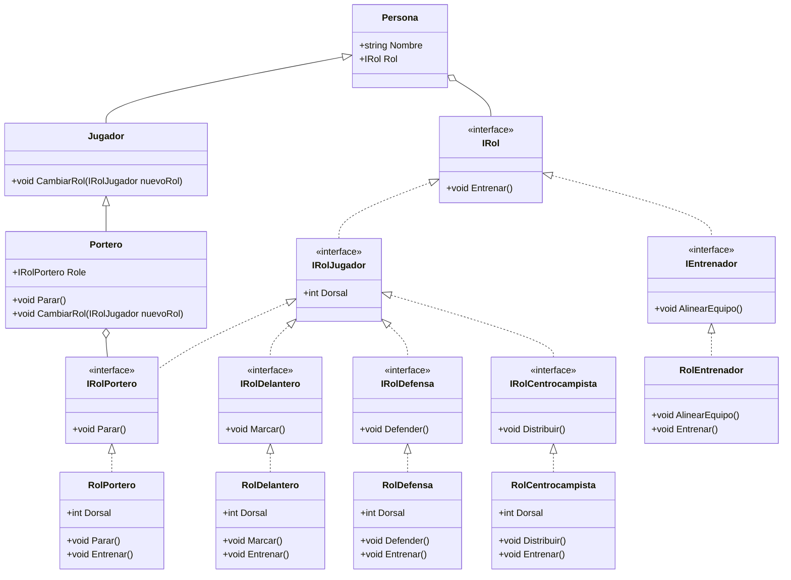

## Enunciado: Sistema de Gestión de Club de Fútbol DawTeam

### Contexto

Un club fútbol profesional necesita un sistema para gestionar a sus integrantes. A diferencia de los sistemas tradicionales donde un empleado tiene un cargo fijo, en este club los miembros pueden **cambiar de funciones (roles) dinámicamente** sin dejar de ser la misma persona.

### Requerimientos de Diseño

1. **Jerarquía de Personas:** Se debe definir una clase base `Persona`. Existe una especialización llamada `Jugador` y, a su vez, una especialización de este último llamada `Portero`.
2. **Desacoplamiento de Roles:** La lógica de lo que una persona *hace* no debe estar ligada a su identidad, sino a un objeto `Rol`. Una `Persona` tiene un `Rol`.
3. **Interfaz de Roles:** Todos los roles deben poder `Entrenar()`.
4. **Especialización de Roles:** * Los **Entrenadores** pueden `AlinearEquipo()`.
* Los **Jugadores** tienen un número de `Dorsal`.
* Existen roles específicos para **Porteros** (`Parar()`), **Defensas** (`Defender()`), **Centrocampistas** (`Distribuir()`) y **Delanteros** (`Marcar()`).
5. **Polimorfismo Dinámico:** El sistema debe permitir que una `Persona` empiece siendo Entrenador y, en tiempo de ejecución, se le asigne un rol de Defensa. Asimismo, un `Jugador` debe poder cambiar su rol táctico mediante un método `CambiarRol`.

---

### Puntos clave del diseño:

* **Composición sobre Herencia:** Aunque usamos herencia para `Persona/Jugador`, el comportamiento específico se delega a la interfaz `IRol`. Esto evita la "explosión de clases" (no necesitamos crear una clase `PersonaEntrenador`, `PersonaPortero`, etc.).
* **Flexibilidad:** Gracias a que la propiedad `Rol` es de tipo `IRol`, podemos asignarle cualquier objeto que implemente dicha interfaz en tiempo de ejecución.
* **Casting Seguro:** En C#, al recuperar comportamientos específicos (como `Parar()`), es necesario realizar un cast, ya que la clase `Persona` solo conoce la interfaz genérica `IRol`.
* **Extensibilidad:** Si en el futuro se añaden nuevos roles (por ejemplo, `PreparadorFisico`), solo es necesario crear una nueva clase que implemente `IRol` sin modificar las clases existentes.
* **Separación de Responsabilidades:** Cada rol tiene su propia interfaz y clase concreta, lo que facilita el mantenimiento y la comprensión del código.

### Patrones de Diseño Utilizados
- Patrón Strategy (Estrategia): Se utiliza para definir una familia de algoritmos (roles), encapsular cada uno y hacerlos intercambiables. El patrón permite que el comportamiento de una `Persona` cambie dinámicamente al asignarle diferentes roles en tiempo de ejecución.
- Patrón Estado: Se utiliza para permitir que un objeto (Persona) cambie su comportamiento cuando su estado interno (rol) cambia. Este patrón es similar al patrón Strategy, pero se enfoca más en el cambio de estado del objeto. En este caso, el rol de una persona puede considerarse un estado State (Estado), aplicado al contexto de un club deportivo. A continuación, presento el enunciado formal del problema y su implementación completa en C#.
